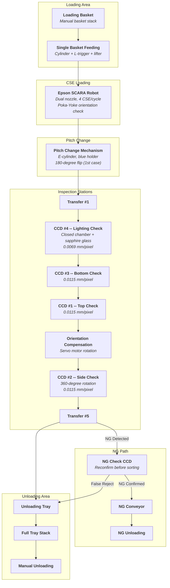

# AOI System for TI CSE Semiconductor

### 4-CCD Multi-Angle Automated Optical Inspection

*Production-grade automated optical inspection system for Texas Instruments CSE*
*(Chip Scale Element) semiconductor packages -- 4 industrial CCD cameras, 19 defect*
*categories, 85,000+ units/day throughput. Built at Dinnar Automation.*

---

[Architecture](#system-architecture) · [Process Flow](#process-flow) · [Source Code](#source-code) · [Documentation](#documentation) · [Tech Stack](#technology-stack)

 

## Overview

This project implements the complete vision inspection and material handling control system for a **4-CCD multi-angle Automated Optical Inspection (AOI) machine** designed for Texas Instruments CSE semiconductor products. CSE packages are circular ceramic carriers with conductive pins on the underside and laser-marked identification codes on the top surface. The system performs 100% inline inspection across 19 defect categories with zero escapes on provided reference samples.

<table>
<tr><td>

**What it does**

- Inspects CSE packages from four angles (top, side, bottom, internal lighting)
- Classifies 19 defect types across Function, Cosmetic, Assembly, and Alignment groups
- Performs closed-chamber lighting checks through sapphire glass and glass cover
- Applies NG double-check reconfirmation to minimize false rejects at high volume
- Compensates CSE orientation via servo rotation before side inspection

</td><td>

**How it works**

- Epson SCARA robot loads CSE with Poka-Yoke orientation check
- Pitch change mechanism with e-cylinder and 180-degree flip positions parts
- 6 transfer stations move CSE through the 18-step inspection sequence
- CCD #1/#2/#3 perform surface and geometry checks at 0.0115 mm/pixel
- CCD #4 performs lighting check in sealed chamber at 0.0069 mm/pixel

</td></tr>
</table>

### Key Specifications

| | |
|---|---|
| **Product** | Texas Instruments CSE (Chip Scale Element) -- circular ceramic package with pins |
| **CCD #1 -- Top Check** | Hikrobot MV-GE501GC, WWK03-110-230 lens, DN-COS60-W light, 0.0115 mm/pixel, FOV 28 x 24 mm, WD 110 +/- 2 mm |
| **CCD #2 -- Side Check** | Hikrobot MV-GE501GC, WWK03-110-230 lens, DN-2BS32738-W light, 0.0115 mm/pixel, FOV 28 x 24 mm, WD 110 +/- 2 mm, 360-degree rotation |
| **CCD #3 -- Bottom Check** | Hikrobot MV-GE501GC, WWK03-110-230 lens, DN-COS60-W light, 0.0115 mm/pixel, FOV 28 x 24 mm, WD 110 +/- 2 mm |
| **CCD #4 -- Lighting Check** | Hikrobot MV-GE2000C-T1P-C, DTCM110-48 lens, DN-HSP25-W hyper light source, 0.0069 mm/pixel, FOV 37.9 x 25.3 mm, WD 140 +/- 3 mm |
| **Defect Categories** | 19 total -- 8 Function, 4 Cosmetic, 5 Assembly, 2 Alignment |
| **Detection Rate** | 100% on provided reference samples |
| **Throughput** | > 85,000 units/day |
| **Machine Dimensions** | 1800 x 1600 x 2000 mm |
| **Material Handling** | Epson SCARA robot (dual nozzle, 4 CSE per pick cycle), 6 transfer stations |
| **Safety** | Tri-Color indicator light, Optical Grating Protection at loading/unloading areas |

---

## Defect Classification

19 defect categories organized by severity group:

| Group | Defects |
|:------|:--------|
| **Function (8)** | Lighting Check, Crack, Broken, Epoxy Exposal, Pin Missing, Electrical Contamination, Gold Exposal, Insufficient Epoxy |
| **Cosmetic (4)** | Dyeing Contamination, Non-Electrical Contamination, No Code, Code Blur |
| **Assembly (5)** | Pin Bent, Pin Oxidized, Pin Bur, Pin Mis-cut, Epoxy Higher Than Ceramic |
| **Alignment (2)** | Misalignment, Staining |

---

## System Architecture

### Process Flow

```mermaid
flowchart LR
    A["Manual Loading\nBasket"] --> B["Single Basket\nFeeding"]
    B --> C["CSE Loading\n(SCARA Robot)"]
    C --> D["Pitch Change\n& Positioning"]
    D --> E["Transfer #1"]
    E --> F["Shade Close\nLighting Check\nCCD #4"]
    F --> G["Bottom Check\nCCD #3"]
    G --> H["Top Check\nCCD #1"]
    H --> I["Orientation\nCompensation"]
    I --> J["Positioning"]
    J --> K["Side Check\nCCD #2\n(360-deg)"]
    K --> L["Transfer #5"]
    L --> M{"Pass?"}
    M -- "OK" --> N["Unload CSE\nto Tray"]
    N --> O["Full Tray\nStack"]
    O --> P["Manual\nUnloading"]
    M -- "NG" --> Q["NG Check CCD\nReconfirm"]
    Q -- "Confirmed NG" --> R["NG Conveyor"]
    R --> S["NG Unloading"]
    Q -- "False Reject" --> N
```

---

## Source Code

> **Python** -- Production control software implementing the complete 18-step AOI sequence, multi-CCD vision pipeline, and material handling coordination.

| File | Description |
|:-----|:------------|
| [`InspectionSequencer.py`](src/inspection/InspectionSequencer.py) | Master 18-step state machine orchestrating the full inspection cycle |
| [`CameraController.py`](src/vision/CameraController.py) | Multi-CCD acquisition and triggering for all 4 cameras + NG Check CCD |
| [`LightingCheckAnalyzer.py`](src/vision/LightingCheckAnalyzer.py) | CCD #4 closed-chamber light leakage analysis with sapphire glass compensation |
| [`DefectClassifier.py`](src/vision/DefectClassifier.py) | 19-category defect classification pipeline across Function/Cosmetic/Assembly/Alignment |
| [`OrientationDetector.py`](src/vision/OrientationDetector.py) | Poka-Yoke orientation detection and servo-based compensation before side check |
| [`RobotController.py`](src/material_handling/RobotController.py) | Epson SCARA robot interface -- dual nozzle control, 4 CSE per pick cycle |
| [`TransferControl.py`](src/material_handling/TransferControl.py) | Transfer #1 through #6 sequence control and inter-station handoff |
| [`PitchChanger.py`](src/material_handling/PitchChanger.py) | Pitch change mechanism with e-cylinder actuation and 180-degree flip logic |
| [`NGSorter.py`](src/ng_management/NGSorter.py) | NG double-check reconfirmation and conveyor sorting logic |
| [`defect_types.py`](src/data_types/defect_types.py) | Defect category definitions, severity mapping, and group classification |
| [`system_config.py`](src/global_variables/system_config.py) | Camera parameters, detection thresholds, and calibration data |

---

## Documentation

Detailed technical documentation covering every subsystem:

| Document | Description |
|:---------|:------------|
| **[System Architecture](docs/system-architecture.md)** | Machine layout, hardware topology, CCD mounting, and communication wiring |
| **[Process Flow](docs/process-flow.md)** | 18-step sequence detail, timing budget, transfer choreography |
| **[Vision System](docs/vision-system.md)** | Camera specs, lens selection, illumination design, calibration procedures |
| **[Defect Classification](docs/defect-classification.md)** | 19 defect categories, detection algorithms, acceptance criteria per group |
| **[Mechanical Design](docs/mechanical-design.md)** | Pitch change mechanism, holder design, closed chamber and sapphire glass assembly |
| **[Safety Design](docs/safety-design.md)** | Optical grating protection, Tri-Color indicator, emergency stop architecture |

---

## Configuration Files

Vision system and illumination configuration for each inspection station:

| File | Description |
|:-----|:------------|
| [`ccd1_top_check.yaml`](config/vision-system/ccd1_top_check.yaml) | CCD #1 parameters -- exposure, gain, ROI, top surface defect thresholds |
| [`ccd2_side_check.yaml`](config/vision-system/ccd2_side_check.yaml) | CCD #2 parameters -- 360-degree rotation profile, pin geometry tolerances |
| [`ccd3_bottom_check.yaml`](config/vision-system/ccd3_bottom_check.yaml) | CCD #3 parameters -- bottom surface inspection, epoxy coverage analysis |
| [`ccd4_lighting_check.yaml`](config/vision-system/ccd4_lighting_check.yaml) | CCD #4 parameters -- closed chamber lighting, hyper light source intensity, leakage thresholds |
| [`illumination_profiles.yaml`](config/lighting/illumination_profiles.yaml) | Illumination profiles per station -- ring light, bar light, hyper source intensity curves |

---

## Technology Stack

| Layer | Components |
|:------|:-----------|
| **Vision** | Hikrobot MV-GE501GC (x3) + MV-GE2000C-T1P-C (x1), 19-category defect classifier, orientation compensation |
| **Optics** | WWK03-110-230 lens (x3), DTCM110-48 telecentric lens (x1), DN-COS60-W / DN-2BS32738-W / DN-HSP25-W lighting |
| **Material Handling** | Epson SCARA robot (dual nozzle), pitch change e-cylinder, 6 transfer stations, NG conveyor |
| **Mechanical** | Closed inspection chamber with sapphire glass + glass cover, 360-degree rotation stage, blue holder with 180-degree flip |
| **Control** | 18-step state machine, NG double-check reconfirmation, Poka-Yoke orientation validation |
| **Safety** | Optical Grating Protection, Tri-Color indicator light, HMI touchscreen |

---

**MIT License** -- See [LICENSE](LICENSE) for details.

