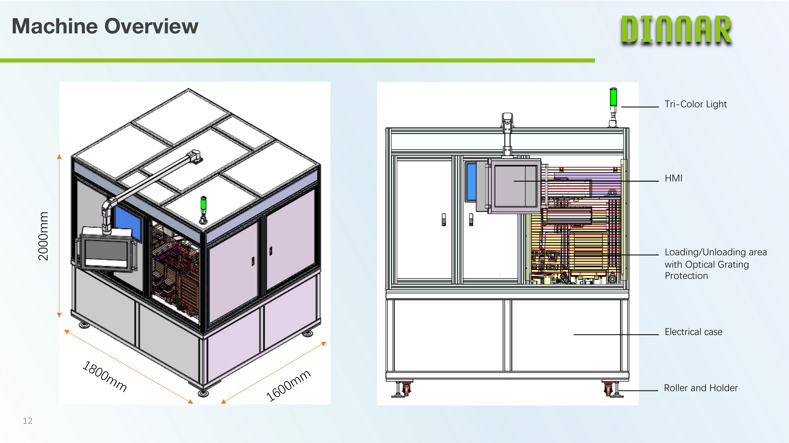
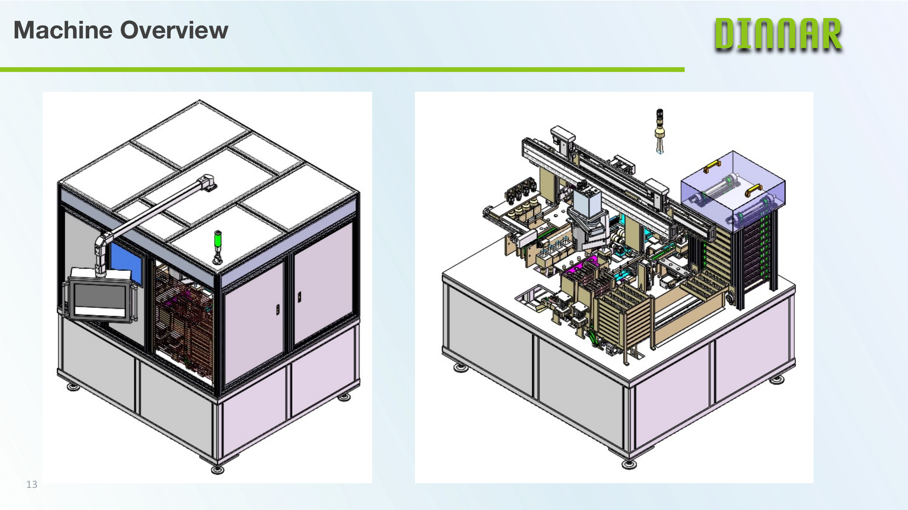
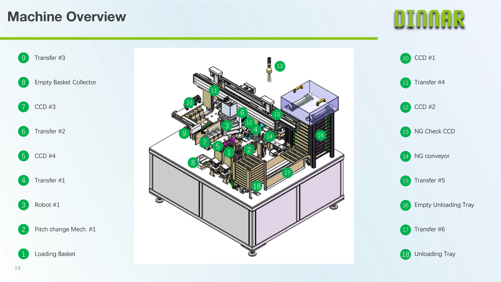
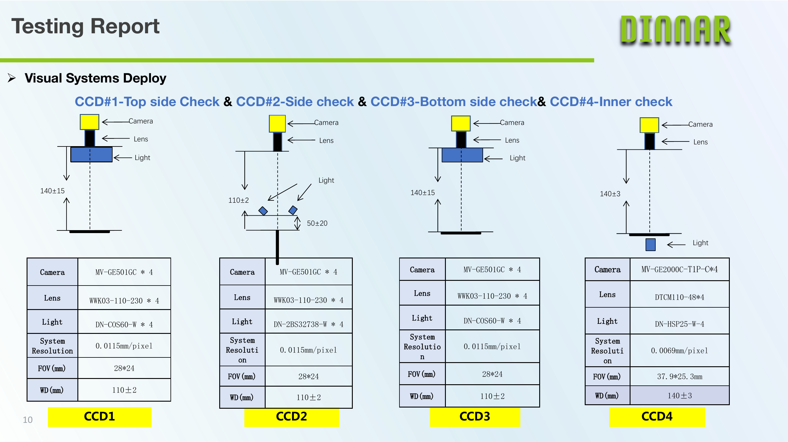
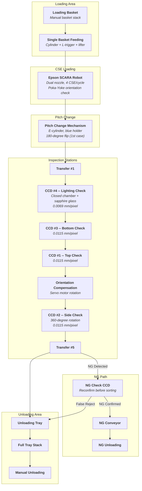
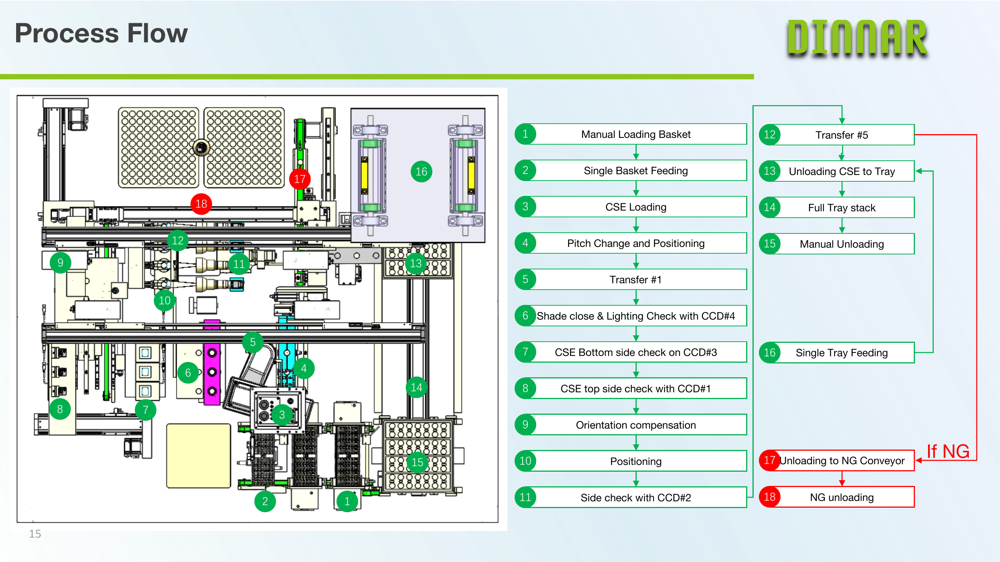

# AOI System for TI CSE Semiconductor

### 4-CCD Multi-Angle Automated Optical Inspection

*Production-grade automated optical inspection system for Texas Instruments CSE (Chip Scale Element)*
*semiconductor packages. 4 industrial CCD cameras, 19 defect categories, 85,000+ units/day throughput.*

---

[Architecture](#system-architecture) · [Process Flow](#process-flow) · [Vision System](#vision-system) · [Source Code](#source-code) · [Documentation](#documentation) · [Tech Stack](#technology-stack)

 

## Machine Overview

  
  

  

  <em>Top left: 3D view with dimensions (1800 x 1600 x 2000 mm), HMI, Tri-Color indicator, optical grating.
  Top right: Enclosure and exploded internal layout.
  Bottom: All 18 numbered stations -- Loading (1-4), Inspection (5-11), Output (12-16), NG Path (17-18).</em>

---

## Overview

This project implements the complete vision inspection and material handling control system for a **4-CCD multi-angle Automated Optical Inspection (AOI) machine** designed for Texas Instruments CSE semiconductor products. CSE packages are circular ceramic carriers with conductive pins on the underside and laser-marked identification codes on the top surface. The system performs 100% inline inspection across 19 defect categories with zero escapes on provided reference samples.

<table>
<tr><td>

**What it does**

- Inspects CSE packages from four angles (top, side, bottom, internal lighting)
- Classifies 19 defect types across Function, Cosmetic, Assembly, and Alignment groups
- Performs closed-chamber lighting checks through sapphire glass and glass cover
- Applies NG double-check reconfirmation to minimize false rejects at high volume
- Compensates CSE orientation via servo rotation before side inspection

</td><td>

**How it works**

- Epson SCARA robot loads CSE with Poka-Yoke orientation check
- Pitch change mechanism with e-cylinder and 180-degree flip positions parts
- 6 transfer stations move CSE through the 18-step inspection sequence
- CCD #1/#2/#3 perform surface and geometry checks at 0.0115 mm/pixel
- CCD #4 performs lighting check in sealed chamber at 0.0069 mm/pixel

</td></tr>
</table>

### Key Specifications

| | |
|---|---|
| **Product** | Texas Instruments CSE (Chip Scale Element) -- circular ceramic package with pins |
| **Machine Dimensions** | 1800 x 1600 x 2000 mm |
| **Throughput** | > 85,000 units/day (pipelined cycle: 3.8s per 4-unit batch) |
| **Detection Rate** | 100% on provided reference samples |
| **Defect Categories** | 19 total -- 8 Function, 4 Cosmetic, 5 Assembly, 2 Alignment |
| **Controller** | IPC (i7-12700) + PLC (2ms scan) + Epson RC700-A + Gardasoft RT820F-20 |
| **Vision Network** | GigE Vision 2.0, VLAN-isolated, Jumbo Frame, hardware-triggered |
| **Fieldbus** | CC-Link IE Field (1 Gbps, 0.5ms cyclic) for servo drives and remote I/O |
| **PLC Communication** | EtherNet/IP (CIP implicit messaging, 10ms cycle) |
| **Safety** | ISO 13849-1 PLd, Category 3 architecture, STO on all servo drives |

---

## Vision System

  

  <em>4-CCD deployment specifications: CCD#1 Top, CCD#2 Side, CCD#3 Bottom (MV-GE501GC, 0.0115mm/px), CCD#4 Inner lighting check (MV-GE2000C, 0.0069mm/px).</em>

| Camera | Model | Lens | Light Source | Resolution | FOV | WD | Function |
|:-------|:------|:-----|:------------|:-----------|:----|:---|:---------|
| CCD #1 | MV-GE501GC | WWK03-110-230 | DN-COS60-W (coaxial) | 0.0115 mm/px | 28 x 24 mm | 110 +/- 2 mm | Top surface, markings, misalignment |
| CCD #2 | MV-GE501GC | WWK03-110-230 | DN-2BS32738-W (bar) | 0.0115 mm/px | 28 x 24 mm | 110 +/- 2 mm | Side + pin inspection, 360-deg rotation |
| CCD #3 | MV-GE501GC | WWK03-110-230 | DN-COS60-W (coaxial) | 0.0115 mm/px | 28 x 24 mm | 110 +/- 2 mm | Bottom surface, epoxy, cracks |
| CCD #4 | MV-GE2000C-T1P-C | DTCM110-48 (telecentric) | DN-HSP25-W (hyper spot) | 0.0069 mm/px | 37.9 x 25.3 mm | 140 +/- 3 mm | Lighting check in closed chamber |

---

## Defect Classification

| Group | Defects | CCD |
|:------|:--------|:----|
| **Function (8)** | Lighting Check, Crack\*, Broken\*, Epoxy Exposal, Pin Missing, Electrical Contamination, Gold Exposal, Insufficient Epoxy | #1, #2, #3, #4 |
| **Cosmetic (4)** | Dyeing Contamination, Non-Electrical Contamination, No Code, Code Blur | #1 |
| **Assembly (5)** | Pin Bent\*, Pin Oxidized, Pin Bur\*, Pin Mis-cut, Epoxy Higher Than Ceramic | #1, #2 |
| **Alignment (2)** | Misalignment\*, Staining on Edge | #4 |

\* = Critical defect (zero tolerance, immediate reject)

---

## System Architecture

---

## Process Flow

  

  <em>18-step process flow: top-down machine layout (left) with numbered station positions, and corresponding step-by-step flowchart (right) showing OK and NG paths.</em>

---

## Documentation

Detailed technical documentation covering every subsystem:

| Document | Topics | Key Content |
|:---------|:-------|:------------|
| **[System Architecture](docs/system-architecture.md)** | Controller hierarchy, communication, I/O | ISA-95 3-tier architecture, GigE Vision 2.0, CC-Link IE Field, EtherNet/IP CIP, VLAN network topology, I/O allocation (128 DI + 48 DO), safety relay architecture |
| **[Process Flow](docs/process-flow.md)** | 18-step sequence, timing, pipelining | Cycle time analysis (3.8s/4-unit batch), station-by-station breakdown, concurrent operation scheduling, throughput calculation |
| **[Vision System](docs/vision-system.md)** | Cameras, optics, illumination, calibration | 4-CCD heterogeneous configuration, Gardasoft RT820F-20 strobe controller, GenICam interface, spatial/illumination calibration pipeline |
| **[Defect Classification](docs/defect-classification.md)** | 19 defect categories, detection algorithms | Per-defect detection method, CCD assignment, severity classification, testing report (100% on all samples) |
| **[Mechanical Design](docs/mechanical-design.md)** | Mechanisms, fixtures, chamber design | Pitch change e-cylinder, SCARA dual nozzle, closed chamber sapphire glass assembly, 360-deg rotation stage, basket feeding mechanism |
| **[Safety Design](docs/safety-design.md)** | E-Stop, light curtains, interlocks | ISO 13849-1 PLd Category 3, Pilz PNOZ safety relay, STO on servo drives, optical grating (IEC 61496 Type 2) |

### Architecture Diagrams

| Diagram | Format | Description |
|:--------|:-------|:------------|
| **[System Architecture Diagram](docs/diagrams/system-architecture.md)** | HTML/CSS (Steel Blue) | 6-layer architecture with sidebars: Material Handling, Transfer, Vision, NG Management, Output, Safety |
| **[Process Flow Diagram](docs/diagrams/process-flow.md)** | HTML/CSS (Pipeline) | 18-step pipeline with color-coded stages: Loading, 4-CCD Inspection, Side Inspection, OK Output, NG Path |
| **[Defect Taxonomy](docs/diagrams/defect-taxonomy.md)** | PlantUML Mindmap | 19 defect categories organized by group, color-coded by severity (critical / needs sample / standard) |

---

## Source Code

> **Python 3.10+** -- Production control software implementing the complete 18-step AOI sequence, multi-CCD vision pipeline, and material handling coordination. See [`src/README.md`](src/README.md) for detailed module documentation.

| Module | File | Description |
|:-------|:-----|:------------|
| **Inspection** | [`InspectionSequencer.py`](src/inspection/InspectionSequencer.py) | Master 18-step state machine orchestrating the full inspection cycle |
| **Vision** | [`CameraController.py`](src/vision/CameraController.py) | Multi-CCD acquisition and triggering (GigE Vision / Hikrobot MVS SDK) |
| | [`LightingCheckAnalyzer.py`](src/vision/LightingCheckAnalyzer.py) | CCD #4 closed-chamber light leakage analysis with sapphire glass compensation |
| | [`DefectClassifier.py`](src/vision/DefectClassifier.py) | 19-category defect classification pipeline (per-CCD detector routing) |
| | [`OrientationDetector.py`](src/vision/OrientationDetector.py) | Poka-Yoke orientation detection and servo compensation angle calculation |
| **Material Handling** | [`RobotController.py`](src/material_handling/RobotController.py) | Epson SCARA interface (SPEL+ TCP/IP), dual nozzle, 4 CSE per pick cycle |
| | [`TransferControl.py`](src/material_handling/TransferControl.py) | Transfer #1-#6 with camera-trigger callbacks and orientation compensation |
| | [`PitchChanger.py`](src/material_handling/PitchChanger.py) | E-cylinder pitch change with 180-degree flip logic |
| **NG Management** | [`NGSorter.py`](src/ng_management/NGSorter.py) | NG double-check reconfirmation, conveyor sorting, per-defect statistics |
| **Data Types** | [`defect_types.py`](src/data_types/defect_types.py) | DefectType enum (19), DefectSeverity, CameraID, InspectionResult dataclasses |
| | [`system_config.py`](src/global_variables/system_config.py) | Camera specs, detection thresholds, transfer positions, timing targets |

---

## Configuration Files

Hardware configuration files for each inspection station:

| File | Description |
|:-----|:------------|
| [`ccd1_top_check.yaml`](config/vision-system/ccd1_top_check.yaml) | CCD #1 -- exposure, gain, ROI, 9 defect thresholds, coaxial illumination profile |
| [`ccd2_side_check.yaml`](config/vision-system/ccd2_side_check.yaml) | CCD #2 -- 360-deg rotation (36 frames), pin geometry tolerances, cylindrical unwrap config |
| [`ccd3_bottom_check.yaml`](config/vision-system/ccd3_bottom_check.yaml) | CCD #3 -- dark chamber enclosure, CLAHE preprocessing, bottom surface defect thresholds |
| [`ccd4_lighting_check.yaml`](config/vision-system/ccd4_lighting_check.yaml) | CCD #4 -- sealed chamber sequence (shade close, DUT power, dark/lit frame), telecentric lens config |
| [`illumination_profiles.yaml`](config/lighting/illumination_profiles.yaml) | Gardasoft RT820F-20 4-channel profiles -- per-station power/strobe/current/delay settings |

---

## Technology Stack

| Layer | Components |
|:------|:-----------|
| **Vision** | Hikrobot MV-GE501GC (x3) + MV-GE2000C-T1P-C (x1), GigE Vision 2.0 (Jumbo Frame, HW trigger), Hikrobot MVS 4.x SDK (GenICam / GenTL) |
| **Optics** | WWK03-110-230 (x3), DTCM110-48 telecentric (x1), Gardasoft RT820F-20 4-channel strobe controller |
| **Illumination** | DN-COS60-W coaxial (x2), DN-2BS32738-W dual bar (x1), DN-HSP25-W hyper spot (x1) |
| **Material Handling** | Epson SCARA (RC700-A controller, SPEL+ TCP/IP), pitch change e-cylinder, 6 linear transfer axes |
| **Control** | IPC (i7-12700 / 32GB / NVMe) + PLC (2ms scan, CC-Link IE Field) + EtherNet/IP CIP |
| **Fieldbus** | CC-Link IE Field (1 Gbps, 0.5ms cyclic) -- 8 servo drives + remote I/O station |
| **Safety** | ISO 13849-1 PLd Cat.3, Pilz PNOZ safety relay, IEC 61496 Type 2 light curtains, ISO 13850 E-Stop |
| **Pneumatics** | SMC SY3000 valve manifold (19 solenoid valves), 0.4-0.6 MPa, vacuum generators |

---

**MIT License** -- See [LICENSE](LICENSE) for details.

