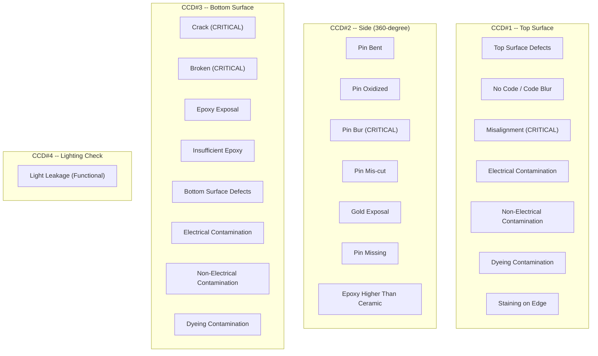

# Defect Classification -- AOI for Texas Instruments CSE Semiconductor Products

**Project:** Automated Optical Inspection System for TI CSE Products  
**Built by:** Rongxuan Zhou, Sole Engineer  
**Company:** Dinnar Automation  
**Client:** Texas Instruments  

---

## 1. Overview

The AOI system classifies defects across 19 categories organized into three groups: Function (8 categories), Cosmetic (4 categories), and Assembly (5 categories). Additionally, two supplementary defect types have been verified. All 19 categories achieved a 100% detection rate on the provided reference samples during system validation.

---

## 2. Defect Taxonomy

### 2.1 Summary Table

| # | Category | Group | Detection CCD | Critical | Notes |
|---|----------|-------|---------------|----------|-------|
| 1 | Lighting Check (Light Leakage) | Function | CCD#4 | -- | Functional test, not cosmetic |
| 2 | Crack | Function | CCD#3 | CRITICAL | Hairline or visible cracks in ceramic |
| 3 | Broken | Function | CCD#3 | CRITICAL | Chipped or fractured ceramic body |
| 4 | Epoxy Exposal | Function | CCD#3 | -- | Adhesive visible where not permitted |
| 5 | Pin Missing | Function | CCD#2 | -- | One or more lead pins absent |
| 6 | Electrical Contamination | Function | CCD#1 / CCD#3 | -- | Conductive foreign material |
| 7 | Gold Exposal | Function | CCD#2 | -- | Exposed gold wire/pad from side view |
| 8 | Insufficient Epoxy | Function | CCD#3 | -- | Epoxy coverage below specification |
| 9 | Dyeing Contamination | Cosmetic | CCD#1 / CCD#3 | -- | Dye/ink staining on surfaces |
| 10 | Non-Electrical Contamination | Cosmetic | CCD#1 / CCD#3 | -- | Non-conductive foreign material |
| 11 | No Code | Cosmetic | CCD#1 | -- | Marking entirely absent |
| 12 | Code Blur | Cosmetic | CCD#1 | -- | Marking illegible or degraded |
| 13 | Pin Bent | Assembly | CCD#2 | -- | Lead pins deformed beyond tolerance |
| 14 | Pin Oxidized | Assembly | CCD#2 | -- | Oxidation/discoloration on pin surface |
| 15 | Pin Bur | Assembly | CCD#2 | CRITICAL | Burrs on pin edges* |
| 16 | Pin Mis-cut | Assembly | CCD#2 | -- | Pins cut incorrectly* |
| 17 | Epoxy Higher Than Ceramic | Assembly | CCD#2 / CCD#3 | -- | Epoxy overflow above ceramic edge |
| 18 | Misalignment | Assembly | CCD#1 | CRITICAL | Package body positional offset |
| 19 | Staining on Edge | Supplementary | CCD#1 / CCD#3 | -- | Inner staining residue, yellow glass cement |

\* Pin Bur and Pin Mis-cut require real production samples for final validation; initial threshold tuning was performed on provided reference samples.

---

## 3. Detailed Defect Descriptions

### 3.1 Function Defects (8 Categories)

These defects affect the electrical or optical functionality of the CSE product. Any unit with a function defect is classified as NG regardless of severity.

---

#### F1: Lighting Check (Light Leakage)

- **Group:** Function
- **Detection CCD:** CCD#4 (closed dark chamber)
- **Description:** The CSE package contains a glass structure designed to transmit light only through designated optical paths. Light leakage occurs when light passes through unintended paths -- indicating cracks in the glass, seal failures, or structural defects in the optical assembly.
- **Detection Method:** Transmitted-light imaging in a sealed dark chamber. The DN-HSP25-W hyper spot light illuminates through the sapphire glass substrate from below. Any light reaching the camera through the glass cover indicates leakage. The telecentric lens (DTCM110-48) ensures uniform magnification for accurate leakage localization.
- **Pass/Fail Criteria:** Any detectable light intensity above the dark-field noise threshold in non-designated regions constitutes a fail.
- **Note:** This is a functional test, not a cosmetic inspection. The defect is invisible under normal visual inspection.

---

#### F2: Crack

- **Group:** Function
- **Detection CCD:** CCD#3 (bottom surface)
- **Critical Defect:** Yes
- **Description:** Hairline or visible cracks in the ceramic substrate. Cracks compromise the hermetic seal and mechanical integrity of the package, leading to potential field failures.
- **Detection Method:** Edge detection and high-pass filtering on the bottom surface image. Cracks appear as dark linear features against the uniform ceramic background under coaxial illumination.
- **Pass/Fail Criteria:** Any crack, regardless of length, constitutes a fail. This is a critical defect with zero tolerance.

---

#### F3: Broken

- **Group:** Function
- **Detection CCD:** CCD#3 (bottom surface)
- **Critical Defect:** Yes
- **Description:** Chipped, fractured, or physically broken ceramic body. Represents severe mechanical damage.
- **Detection Method:** Blob analysis and edge integrity checking. Broken regions appear as missing or irregular portions of the expected package outline.
- **Pass/Fail Criteria:** Any breakage constitutes a fail. This is a critical defect with zero tolerance.

---

#### F4: Epoxy Exposal

- **Group:** Function
- **Detection CCD:** CCD#3 (bottom surface)
- **Description:** Adhesive epoxy is visible on surfaces where it should not be present. Indicates manufacturing process deviation in die attach or lid seal.
- **Detection Method:** Color/intensity segmentation. Epoxy typically has a different color signature (amber/brown) from the ceramic substrate (white/grey) and metal features.
- **Pass/Fail Criteria:** Epoxy visible outside the designated bonding area beyond the area tolerance threshold.

---

#### F5: Pin Missing

- **Group:** Function
- **Detection CCD:** CCD#2 (side view, 360-degree rotation)
- **Description:** One or more lead pins are entirely absent from their expected positions.
- **Detection Method:** Pin counting and position verification during 360-degree rotation. Expected pin positions are defined per product recipe; missing positions are flagged.
- **Pass/Fail Criteria:** Any missing pin constitutes a fail.

---

#### F6: Electrical Contamination

- **Group:** Function
- **Detection CCD:** CCD#1 (top) and CCD#3 (bottom)
- **Description:** Conductive foreign material (metal particles, solder splash, conductive debris) on the package surface that could cause short circuits.
- **Detection Method:** Intensity and reflectivity analysis. Metallic contamination exhibits distinct specular reflection characteristics under coaxial illumination, distinguishing it from non-electrical contamination.
- **Pass/Fail Criteria:** Any conductive particle above the minimum detectable size.

---

#### F7: Gold Exposal

- **Group:** Function
- **Detection CCD:** CCD#2 (side view, 360-degree rotation)
- **Description:** Gold bonding wire or gold pad is visible from the exterior side view, indicating that the encapsulation or lid seal has failed to fully contain the internal wire bonds.
- **Detection Method:** Color analysis in the side-view images. Gold exhibits a distinctive warm yellow hue that is identified through HSV color space analysis against the expected grey/silver pin and ceramic background.
- **Pass/Fail Criteria:** Any visible gold outside the package boundary.

---

#### F8: Insufficient Epoxy

- **Group:** Function
- **Detection CCD:** CCD#3 (bottom surface)
- **Description:** Epoxy adhesive coverage is below the minimum specification, indicating inadequate die attach or lid seal strength.
- **Detection Method:** Area measurement of the epoxy region in the bottom-view image. The detected epoxy area is compared against the minimum coverage threshold defined in the product recipe.
- **Pass/Fail Criteria:** Epoxy coverage area below the recipe-specified minimum percentage.

---

### 3.2 Cosmetic Defects (4 Categories)

Cosmetic defects do not affect electrical or optical functionality but represent visual quality deviations. Depending on customer specification, cosmetic defects may be graded (minor/major) or treated as outright rejects.

---

#### C1: Dyeing Contamination

- **Group:** Cosmetic
- **Detection CCD:** CCD#1 (top) and CCD#3 (bottom)
- **Description:** Dye, ink, or colored staining on the top or bottom package surfaces. May originate from handling, marking process overflow, or environmental exposure.
- **Detection Method:** Color analysis. Dye contamination presents as localized color deviations from the expected uniform surface color.
- **Pass/Fail Criteria:** Stained area exceeding the recipe-defined size threshold.

---

#### C2: Non-Electrical Contamination

- **Group:** Cosmetic
- **Detection CCD:** CCD#1 (top) and CCD#3 (bottom)
- **Description:** Non-conductive foreign material (dust, fiber, organic debris) on the package surface. Distinguished from electrical contamination by reflectivity and color analysis.
- **Detection Method:** Blob analysis with intensity thresholding. Non-conductive particles typically appear darker and less reflective than metallic contaminants under coaxial illumination.
- **Pass/Fail Criteria:** Particle area exceeding the recipe-defined size threshold.

---

#### C3: No Code

- **Group:** Cosmetic
- **Detection CCD:** CCD#1 (top surface)
- **Description:** The product marking (part number, date code, lot code) is entirely absent from the top surface.
- **Detection Method:** Template matching and pattern presence detection in the designated marking region of interest. No matching pattern indicates missing marking.
- **Pass/Fail Criteria:** Marking correlation score below the minimum presence threshold (effectively zero match).

---

#### C4: Code Blur

- **Group:** Cosmetic
- **Detection CCD:** CCD#1 (top surface)
- **Description:** The product marking is present but illegible, smeared, faded, or otherwise degraded. The marking cannot be reliably read.
- **Detection Method:** Template matching quality score and edge sharpness analysis of the marking characters. A present but low-quality marking falls between the "no code" threshold and the "acceptable" threshold.
- **Pass/Fail Criteria:** Marking correlation score above presence threshold but below legibility threshold.

---

### 3.3 Assembly Defects (5 Categories)

Assembly defects are related to the mechanical assembly and packaging process -- primarily lead pin integrity and epoxy application.

---

#### A1: Pin Bent

- **Group:** Assembly
- **Detection CCD:** CCD#2 (side view, 360-degree rotation)
- **Description:** One or more lead pins are mechanically deformed (bent inward, outward, or twisted) beyond the coplanarity tolerance.
- **Detection Method:** Pin profile measurement during 360-degree rotation. The expected straight-pin profile is compared against the measured pin silhouette. Deviation from the reference profile beyond the tolerance band triggers a defect flag.
- **Pass/Fail Criteria:** Pin tip deviation from the reference plane exceeding the recipe-specified coplanarity tolerance (typically in the range of 0.05-0.10 mm).

---

#### A2: Pin Oxidized

- **Group:** Assembly
- **Detection CCD:** CCD#2 (side view, 360-degree rotation)
- **Description:** Discoloration or oxidation on lead pin surfaces, indicating environmental degradation or improper storage.
- **Detection Method:** Color and intensity analysis of the pin surface regions. Oxidized pins exhibit a dull, discolored appearance (brown, dark grey) compared to the expected bright metallic finish.
- **Pass/Fail Criteria:** Oxidation coverage on any pin exceeding the recipe-defined area percentage threshold.

---

#### A3: Pin Bur *

- **Group:** Assembly
- **Detection CCD:** CCD#2 (side view, 360-degree rotation)
- **Critical Defect:** Yes
- **Description:** Burrs or excess material remaining on pin edges from the trimming/forming process. Burrs can interfere with PCB assembly (soldering, socket insertion) and pose short-circuit risks.
- **Detection Method:** Edge roughness analysis on pin outlines. Burrs appear as irregular protrusions along the expected smooth pin edge profile.
- **Pass/Fail Criteria:** Any detectable burr protrusion exceeding the minimum size threshold.
- **Note:** * This defect category requires real production samples for final validation and threshold tuning. Initial detection algorithms were developed and tested using available reference samples, but production-representative burr morphology may differ.

---

#### A4: Pin Mis-cut *

- **Group:** Assembly
- **Detection CCD:** CCD#2 (side view, 360-degree rotation)
- **Description:** Pins cut to incorrect length, with irregular trim profiles, or with angular trim cuts instead of clean perpendicular cuts.
- **Detection Method:** Pin length measurement and trim-face profile analysis during 360-degree rotation.
- **Pass/Fail Criteria:** Pin length deviation from nominal exceeding the recipe-specified tolerance; trim-face angle deviation beyond specification.
- **Note:** * This defect category requires real production samples for final validation and threshold tuning.

---

#### A5: Epoxy Higher Than Ceramic

- **Group:** Assembly
- **Detection CCD:** CCD#2 (side view) and CCD#3 (bottom view)
- **Description:** Epoxy adhesive has overflowed above the ceramic body edge, creating a raised protrusion that could interfere with assembly or sealing.
- **Detection Method:** Profile height analysis in side view (epoxy ridge visible above the ceramic edge line); area/intensity analysis in bottom view.
- **Pass/Fail Criteria:** Epoxy height above ceramic edge exceeding the recipe-defined maximum.

---

#### A6: Misalignment

- **Group:** Assembly
- **Detection CCD:** CCD#1 (top surface)
- **Critical Defect:** Yes
- **Description:** The CSE package body is offset from its expected position, indicating placement error during assembly. Misalignment may affect pin alignment with PCB pads.
- **Detection Method:** Pattern matching of package body features (edges, fiducials) against expected positions. Positional and angular offsets are computed.
- **Pass/Fail Criteria:** Positional offset exceeding the recipe-defined maximum (X, Y, and theta).

---

### 3.4 Supplementary: Staining on Edge

- **Group:** Supplementary
- **Detection CCD:** CCD#1 (top) and CCD#3 (bottom)
- **Description:** Inner staining residue with yellow glass cement visible on the edge of the CSE package. This is a specific contamination pattern associated with the glass-ceramic sealing process.
- **Detection Method:** Color analysis targeting the yellow-tinted staining characteristic of glass cement residue.
- **Validation Status:** Tested with 10 samples across 2 types (5 samples each) -- all 10 samples detected successfully (100% detection rate, OK).

---

## 4. Critical Defect Summary

The following defects are designated as critical, meaning they represent the highest severity and require zero-tolerance enforcement:

| Defect | Reason for Critical Designation |
|--------|---------------------------------|
| Crack | Compromises hermetic seal and mechanical integrity; potential latent field failure |
| Broken | Severe structural damage; non-functional |
| Pin Bur | Short-circuit risk; assembly interference; safety concern |
| Misalignment | Pin-to-pad alignment failure; potential assembly and reliability issue |

Critical defects trigger an immediate NG classification with no allowance for borderline decisions. These units always pass through the NG Check CCD reconfirmation to ensure the rejection is not a false positive.

---

## 5. Defect-to-CCD Mapping

---

## 6. Testing and Validation Report

### 6.1 Sample-Based Validation

The defect detection system was validated using reference samples provided by Texas Instruments. For each of the 19 defect categories, one or more known-defect samples were tested.

| Metric | Result |
|--------|--------|
| Total defect categories defined | 19 |
| Categories tested with reference samples | 19 |
| Detection rate on provided samples | **100%** |
| Categories requiring production sample validation | 2 (Pin Bur, Pin Mis-cut) |
| Supplementary tests (Staining on Edge) | 10 samples x 2 types = all OK |

### 6.2 Validation Notes

1. **Pin Bur and Pin Mis-cut:** Detection algorithms are implemented and tuned against available reference samples. However, real production-line burr and mis-cut morphology may vary. Final threshold tuning and validation with production samples is recommended before volume production sign-off.

2. **Staining on Edge:** This supplementary defect (inner staining residue with yellow glass cement) was tested with 10 samples across 2 types. All 10 samples were correctly detected, confirming reliable detection of this specific contamination pattern.

3. **False Reject Mitigation:** The NG double-check mechanism (NG Check CCD reconfirmation) provides a safety net against false rejects. At the target throughput of over 85,000 units per day, even a small false reject rate would produce significant unnecessary waste. The reconfirmation step ensures that units flagged by the primary inspection cameras are re-examined before being committed to the NG tray.

### 6.3 Ongoing Validation Recommendations

- Insert golden reference samples (known-good and known-defect) at regular intervals during production to monitor detection consistency.
- Track per-category NG rates over time to detect threshold drift or process shifts.
- Collect and review NG reconfirmation images to measure the false reject rate and refine thresholds accordingly.
- Once production samples for Pin Bur and Pin Mis-cut are available, conduct a dedicated validation campaign with a statistically significant sample size.
