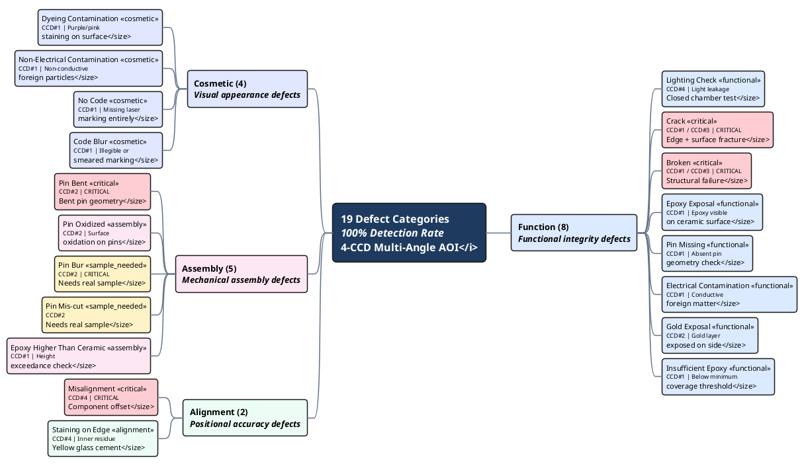

# CSE Defect Classification Taxonomy

## Legend

| Marker | Meaning |
|:-------|:--------|
| Red background | CRITICAL defect -- zero tolerance, immediate reject |
| Yellow background | Requires real production samples for validation |
| Blue background | Function group defect |
| Purple background | Cosmetic group defect |
| Pink background | Assembly group defect |
| Green background | Alignment group defect |

## CCD Assignment Summary

| Camera | Defects Detected | Count |
|:-------|:----------------|------:|
| CCD#1 (Top) | Crack, Broken, Epoxy Exposal, Pin Missing, Electrical Contamination, Insufficient Epoxy, Dyeing Contamination, Non-Electrical Contamination, No Code, Code Blur, Epoxy Higher Than Ceramic | 11 |
| CCD#2 (Side) | Gold Exposal, Pin Bent, Pin Oxidized, Pin Bur, Pin Mis-cut | 5 |
| CCD#3 (Bottom) | Crack, Broken | 2 |
| CCD#4 (Lighting) | Lighting Check, Misalignment, Staining on Edge | 3 |
