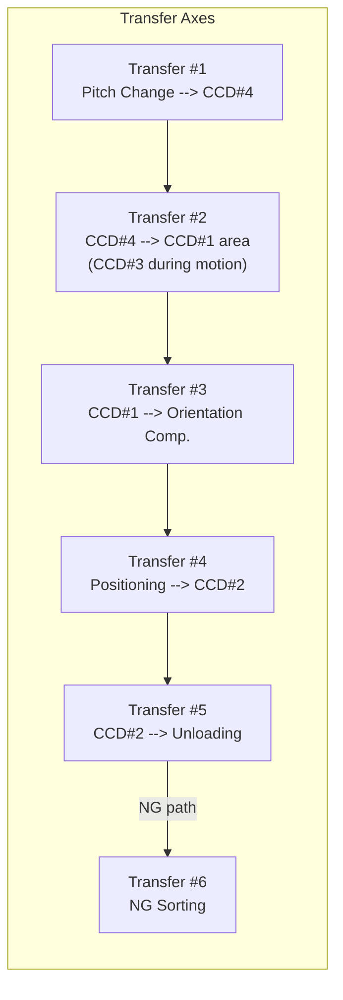
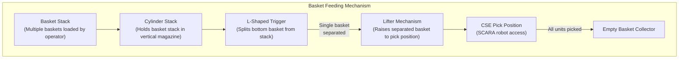
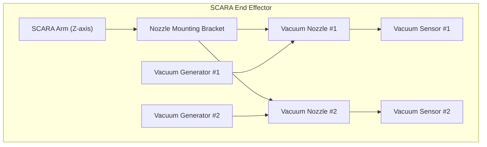
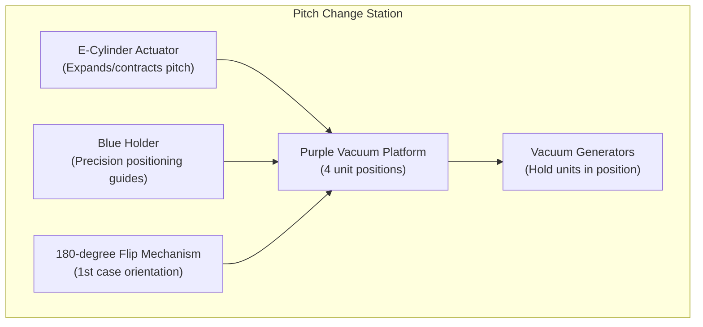
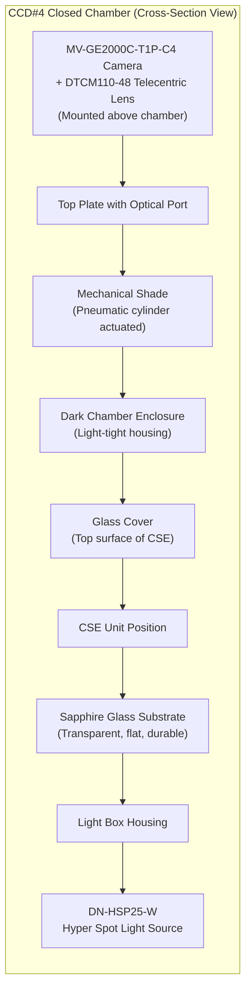
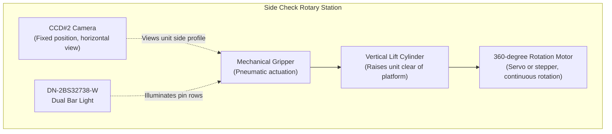
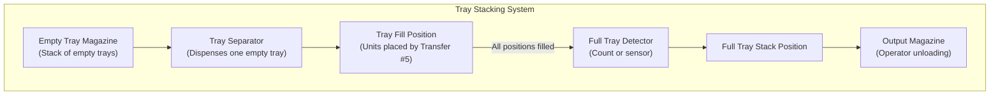

# Mechanical Design -- AOI for Texas Instruments CSE Semiconductor Products

**Project:** Automated Optical Inspection System for TI CSE Products  
**Built by:** Rongxuan Zhou, Sole Engineer  
**Company:** Dinnar Automation  
**Client:** Texas Instruments  

---

## 1. Overall Machine Layout

### 1.1 Envelope Dimensions

| Parameter | Value |
|-----------|-------|
| Length (L) | 1800 mm |
| Width (W) | 1600 mm |
| Height (H) | 2000 mm |
| Frame Construction | Aluminum extrusion profile frame |
| Base | Steel base plate on roller casters with adjustable leveling feet and holder base |
| Enclosure | Polycarbonate panels with interlocked access doors |

### 1.2 Machine Layout Overview

The machine is organized in a linear flow from left to right (as viewed from the operator front), with the operator interface on the front side for loading (left) and unloading (right). The 18 functional stations are arranged within the machine envelope as follows:

```
+-----------------------------------------------------------------------+
|                        MACHINE TOP (2000mm height)                     |
|  Tri-Color Indicator Light                                             |
+-----------------------------------------------------------------------+
|                                                                        |
|  REAR (Maintenance Access Side)                                        |
|                                                                        |
|  +--------+  +--------+  +--------+  +--------+  +--------+           |
|  | Empty  |  | CCD#4  |  | CCD#3  |  | CCD#1  |  | CCD#2  |          |
|  | Basket |  | Chamber|  | Bottom |  | Top    |  | Side   |          |
|  | Coll.  |  | (6)    |  | (7)    |  | (9)    |  | (12)   |          |
|  +--------+  +--------+  +--------+  +--------+  +--------+           |
|                                                                        |
|  +--------+  +--------+  +--------+  +--------+  +--------+           |
|  | Basket |  | SCARA  |  | Pitch  |  | Xfer   |  | Orient.|          |
|  | Feed   |  | Robot  |  | Change |  | Axes   |  | Comp.  |          |
|  | (2)    |  | (3)    |  | (4)    |  | (5,8)  |  | (10,11)|          |
|  +--------+  +--------+  +--------+  +--------+  +--------+           |
|                                                                        |
|  +--------+                                       +--------+  +------+|
|  | Basket |                                       | Tray   |  | NG   ||
|  | Input  |                                       | Stack  |  | Tray ||
|  | (1)    |                                       | (14,15)|  | (18) ||
|  +--------+                                       +--------+  +------+|
|                                                                        |
|  FRONT (Operator Side)                                                 |
|  [Optical Grating]            [Optical Grating]                        |
|  Loading Area                 Unloading Area                           |
+-----------------------------------------------------------------------+
```

### 1.3 Functional Station Index

| Station # | Name | Function |
|-----------|------|----------|
| 1 | Manual Loading Basket | Operator loads baskets into input magazine |
| 2 | Single Basket Feeding | Separates and lifts individual baskets |
| 3 | CSE Loading (Epson SCARA) | Robot picks and places CSE units |
| 4 | Pitch Change | Adjusts unit spacing for inspection |
| 5 | Transfer #1 | Moves units to CCD#4 station |
| 6 | Shade Close + CCD#4 Lighting Check | Sealed chamber functional test |
| 7 | CCD#3 Bottom Check | Bottom surface inspection (during Transfer #2) |
| 8 | Transfer #2 | Moves units from CCD#4 toward CCD#1 |
| 9 | CCD#1 Top Check | Top surface inspection |
| 10 | Orientation Compensation | Fine angular correction |
| 11 | Positioning | Precision alignment for side check |
| 12 | CCD#2 Side Check | 360-degree pin inspection |
| 13 | Transfer #5 | Moves units to sorting/unloading |
| 14 | Unloading CSE to Tray | Places pass units into trays |
| 15 | Full Tray Stack | Stacks completed trays |
| 16 | Manual Unloading | Operator removes tray stacks |
| 17 | NG Check CCD Reconfirm | Double-checks NG units |
| 18 | NG Conveyor + NG Tray | Conveys confirmed NG to NG tray |

---

## 2. Transfer Mechanism Design

### 2.1 Overview

The machine uses 6 linear transfer axes to move CSE units through the inspection pipeline. These axes are the backbone of the material flow, connecting all inspection and handling stations.



### 2.2 Transfer Axis Specifications

Each transfer axis consists of:

- **Linear guide rail** -- Precision ground linear rail (e.g., THK or equivalent) mounted on the machine base plate, providing smooth low-friction guidance.
- **Actuation** -- Ball screw or belt-driven linear actuator powered by servo or stepper motor for precise position control.
- **End-of-travel sensors** -- Inductive or photoelectric sensors at both ends of travel for homing and over-travel protection.
- **Unit holding** -- Vacuum pads or mechanical clamps on the transfer carriage to secure CSE units during motion.

### 2.3 Pipelining Through Transfer Design

The 6 transfer axes enable pipelining -- while Transfer #2 is moving a set of units, Transfer #1 can simultaneously load the next set. This overlap is fundamental to achieving sub-1-second per-unit cycle time.

The critical pipelining optimization is at Transfer #2: CCD#3 (bottom check) captures images of the units while they are in transit on the Transfer #2 carriage. The camera is mounted below the transfer path, looking upward, and fires a triggered exposure as the units pass through the CCD#3 field of view. This eliminates a dedicated stop-and-inspect step for bottom inspection.

---

## 3. Basket Feeding Mechanism

### 3.1 Mechanism Description

The basket feeding station receives stacks of baskets loaded by the operator and separates them one at a time for CSE picking.



### 3.2 Operating Sequence

1. **Stack loading:** The operator places a stack of filled baskets into the vertical magazine. The cylinder stack mechanism holds the stack in position.
2. **L-trigger separation:** A pneumatic cylinder drives an L-shaped trigger blade horizontally between the bottom basket and the basket above it. The L-trigger engages under the second-from-bottom basket, supporting the rest of the stack, while the bottom basket is released downward.
3. **Lifter raise:** A pneumatic or servo-driven lifter mechanism catches the released basket and raises it to the CSE pick position, where the Epson SCARA robot can access the units.
4. **Picking:** The SCARA robot picks all CSE units from the basket (4 per cycle, multiple cycles if needed).
5. **Empty basket disposal:** Once all units are picked, the lifter lowers and the empty basket is transferred (by pusher or gravity) to the Empty Basket Collector.
6. **Repeat:** The L-trigger retracts, releasing the next basket, and the cycle repeats.

### 3.3 Key Design Features

- **Gravity-assisted stack feeding** -- The stack naturally feeds downward under gravity, with the L-trigger providing controlled release.
- **Basket alignment guides** -- Vertical guide rails ensure baskets remain aligned within the magazine during feeding.
- **Basket presence sensor** -- A photoelectric sensor detects when the magazine is empty to alert the operator for reloading.

---

## 4. CSE Loading with Epson SCARA Robot

### 4.1 Robot Configuration

The Epson SCARA (Selective Compliance Assembly Robot Arm) is the primary pick-and-place handler for loading CSE units from baskets onto the pitch change platform.

| Parameter | Specification |
|-----------|---------------|
| Robot Type | Epson SCARA (4-axis: X, Y, Z, Theta) |
| Controller | Epson RC+ dedicated controller |
| End Effector | Dual vacuum nozzle assembly |
| Cycle | 4 units per loading cycle (2 picks x 2 nozzles) |
| Orientation Check | Poka-Yoke CCD at pick station |
| Rotation Capability | 90-degree increments for orientation correction |

### 4.2 Dual Vacuum Nozzle End Effector



The dual nozzle design allows the SCARA to pick 2 CSE units per descent, reducing the number of pick-place cycles by half and directly contributing to cycle time reduction.

### 4.3 Poka-Yoke CCD Orientation Check

Before placing each unit onto the pitch change platform, the SCARA positions the picked unit in front of a dedicated Poka-Yoke CCD camera. This camera:

1. Captures an image of the CSE unit as held by the vacuum nozzle.
2. Analyzes the image to determine the unit's current angular orientation (0, 90, 180, or 270 degrees).
3. If the orientation is incorrect relative to the required placement orientation, the SCARA's theta axis applies a 90-degree rotation correction.
4. The corrected unit is then placed onto the pitch change platform in the correct orientation.

This Poka-Yoke (error-proofing) step prevents misoriented units from entering the inspection pipeline, which would cause false defect detections and potentially jam downstream handling.

### 4.4 Loading Sequence

1. SCARA moves to basket position and descends; both nozzles pick 2 units simultaneously.
2. SCARA ascends and moves to Poka-Yoke CCD position.
3. Nozzle #1 unit is checked; rotation applied if needed; unit placed on pitch change platform position 1.
4. Nozzle #2 unit is checked; rotation applied if needed; unit placed on position 2.
5. Repeat steps 1-4 for positions 3 and 4.
6. Total: 4 units loaded per full cycle (2 picks x 2 nozzles).

---

## 5. Pitch Change Mechanism

### 5.1 Purpose

The pitch change mechanism adjusts the spacing (pitch) between CSE units to match the pitch required by the downstream inspection stations. Units are loaded at the basket pitch (tightly packed) and need to be spread to the inspection pitch.

### 5.2 Mechanism Components



### 5.3 Operating Sequence

1. **Unit placement:** The SCARA places 4 CSE units onto the purple vacuum platform at the loading pitch.
2. **Vacuum engage:** Vacuum is applied to hold all 4 units securely on the platform.
3. **E-cylinder expansion:** The electric cylinder (e-cylinder) actuator drives a mechanical linkage that expands the spacing between the 4 unit positions from the loading pitch to the inspection pitch. The e-cylinder provides precise, repeatable stroke control.
4. **Blue holder positioning:** Blue precision positioning holders (mechanical guides or stops) engage to lock each unit at the exact inspection pitch position.
5. **1st case 180-degree flip:** For the first case orientation requirement, a flip mechanism rotates the unit 180 degrees to present the correct surface for inspection. This is necessary when the basket orientation differs from the required inspection orientation.
6. **Transfer:** Units are picked from the pitch change platform by Transfer #1 and moved to the CCD#4 station.

### 5.4 Key Design Features

- **E-cylinder actuation** -- Chosen over pneumatic cylinders for the pitch change because it provides precise, programmable stroke positions. This allows the same mechanism to accommodate different CSE product variants with different pitch requirements by changing the e-cylinder target position in the recipe.
- **Vacuum holding** -- Ensures units do not shift during the pitch expansion motion.
- **Blue holder precision** -- Mechanical guides ensure final pitch accuracy within +/- 0.05 mm.

---

## 6. CCD#4 Closed-Chamber Design

### 6.1 Purpose

CCD#4 performs a functional light-leakage test that requires a completely dark environment to detect faint light transmission through the CSE glass structure. A sealed dark chamber eliminates ambient light interference.

### 6.2 Chamber Construction



### 6.3 Component Details

**Sapphire Glass Substrate:**
- Material: Synthetic sapphire (Al2O3 single crystal)
- Properties: Excellent optical transmission (UV through visible), extremely high hardness (9 on Mohs scale), chemical inertness, thermal stability
- Purpose: Serves as the transparent support surface for the CSE unit. The hyper spot light illuminates from below through the sapphire glass. Sapphire is chosen over standard glass because its superior flatness (lapped to optical quality) ensures consistent optical coupling, and its hardness prevents scratching from repeated unit loading/unloading.

**Glass Cover:**
- Located on the top surface of the CSE unit (part of the CSE product itself)
- Any light leaking through the CSE structure exits through this glass cover and is captured by the camera above.

**Mechanical Shade:**
- A pneumatic cylinder-actuated shade plate that closes over the chamber opening before image capture.
- When closed, the chamber is completely sealed from ambient light.
- Opens to allow unit loading/unloading via the transfer mechanism.
- Shade open/close cycle time: approximately 100 ms.

**DN-HSP25-W Hyper Spot Light:**
- High-intensity white LED spot light designed for transmitted-light applications.
- Concentrated beam provides sufficient illumination power to reveal even the smallest leakage paths in the CSE glass structure.
- Controlled via the lighting controller for intensity adjustment and strobe synchronization.

### 6.4 Inspection Sequence

1. Transfer #1 places units into the chamber on the sapphire glass substrate.
2. Mechanical shade closes (pneumatic cylinder extends).
3. Hyper spot light activates.
4. CCD#4 acquires image through the telecentric lens.
5. Image is analyzed for any light reaching the camera through unintended paths.
6. Hyper spot light deactivates.
7. Mechanical shade opens.
8. Transfer #2 removes units from the chamber.

---

## 7. Side Check Rotary Station (CCD#2)

### 7.1 Purpose

CCD#2 must inspect all four sides of the CSE package for pin defects. Since the camera is fixed, the CSE unit must be rotated to present all sides to the camera.

### 7.2 Mechanism Design



### 7.3 Operating Sequence

1. **Transfer delivery:** The unit arrives at the side check station via transfer axis and is positioned on the platform.
2. **Gripper engage:** A pneumatic gripper grasps the CSE unit by the top and bottom surfaces (or by non-critical edges), securing it without obscuring the pin rows.
3. **Lift:** A vertical lift cylinder raises the gripped unit above the platform to provide clearance for 360-degree rotation without interference.
4. **Rotation and capture:** The servo motor rotates the unit through 360 degrees. CCD#2 captures images at defined angular intervals (e.g., 4 captures at 0, 90, 180, and 270 degrees to image each pin row, or continuous multi-frame capture with triggered acquisition).
5. **Analysis:** All captured side images are processed for pin defects (bent, oxidized, bur, mis-cut) and gold exposure.
6. **Lower and release:** The motor returns to the home position, the lift lowers, and the gripper releases the unit back onto the platform.
7. **Transfer out:** Transfer #5 moves the unit to the sorting/unloading station.

### 7.4 Key Design Features

- **Gripper design** -- The gripper must hold the unit securely during rotation while leaving all pin rows fully visible. A top-bottom clamp design is used, gripping the flat ceramic surfaces.
- **Rotation precision** -- The servo motor provides precise angular positioning to ensure that pin rows are consistently aligned with the camera field of view at each capture angle.
- **Rotation speed** -- Optimized to complete the full 360-degree capture cycle within approximately 150 ms, balancing rotation speed against image exposure requirements.

---

## 8. Tray Stacking System

### 8.1 Purpose

Inspected pass units are placed into output trays in a defined array pattern. Full trays are stacked and presented to the operator for unloading.

### 8.2 Mechanism Design



### 8.3 Operating Sequence

1. An empty tray is dispensed from the empty tray magazine and positioned at the fill station.
2. Transfer #5 places inspected pass units into the tray one at a time (or in batches) following the defined array pattern.
3. A unit counter or sensor detects when the tray is full.
4. The full tray is moved to the stacking position and stacked onto the output magazine.
5. A new empty tray is dispensed and the cycle repeats.
6. The operator removes full tray stacks from the output magazine when the stack reaches the defined height.

---

## 9. NG Sorting Path

### 9.1 NG Check CCD Reconfirmation Station

Units flagged as NG by any of the four main inspection cameras are diverted to a dedicated NG reconfirmation station before being committed to the NG tray. This station has its own CCD camera and re-inspects the flagged defect to confirm the NG determination.

### 9.2 NG Conveyor

Confirmed NG units are placed onto a conveyor belt that transports them to the NG tray. The conveyor is a simple belt-driven mechanism that operates independently of the main inspection pipeline.

### 9.3 NG Tray

A dedicated NG tray collects confirmed NG units for offline analysis, rework, or scrap disposition.

---

## 10. Base and Stability Design

### 10.1 Roller and Holder Base

The machine base incorporates:

- **Roller casters (4x or 6x):** Allow the machine to be repositioned on the production floor for installation and layout changes.
- **Adjustable leveling feet:** Screw-type leveling feet with lock nuts, deployed after positioning to provide a stable, level foundation. The leveling feet lift the rollers off the floor to prevent vibration transmission.
- **Holder base structure:** A reinforced steel base frame distributes the machine weight and provides rigidity. The holder base design prevents rocking or tilting that could affect vision system calibration accuracy.

### 10.2 Vibration Considerations

Precision vision inspection requires a vibration-free environment. The following measures are implemented:

- **Rigid frame construction:** The aluminum extrusion frame is cross-braced for structural rigidity.
- **Isolated camera mounts:** Camera mounting brackets are designed with minimal overhang and high stiffness to avoid resonance with machine motion.
- **Motion profile optimization:** Transfer axes use trapezoidal or S-curve motion profiles with controlled acceleration/deceleration to minimize settling time and vibration excitation.
- **Pneumatic damping:** Pneumatic cylinders include flow-control valves to cushion end-of-stroke impacts.
