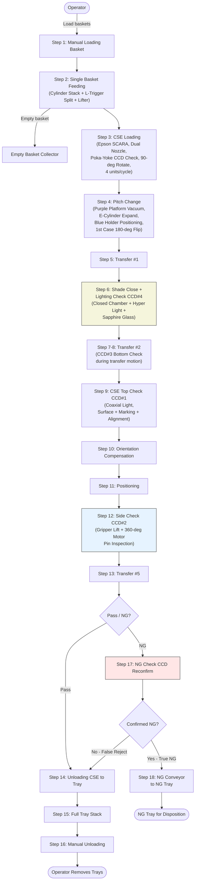
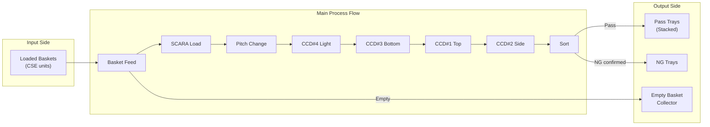

# Process Flow -- AOI for Texas Instruments CSE Semiconductor Products

**Project:** Automated Optical Inspection System for TI CSE Products  
**Built by:** Rongxuan Zhou, Sole Engineer  
**Company:** Dinnar Automation  
**Client:** Texas Instruments  

---

## 1. Process Overview

The AOI system processes CSE (Ceramic Staggered-lead Encapsulation) semiconductor packages through an 18-step inspection pipeline. Each unit undergoes functional testing (light leakage), multi-angle surface inspection (top, bottom, side with 360-degree rotation), and defect classification across 19 categories. The system targets a throughput exceeding 85,000 units per day, requiring a cycle time of less than 1 second per unit.

---

## 2. Complete 18-Step Process Flow

### Step-by-Step Description

| Step | Station | Description |
|------|---------|-------------|
| 1 | Manual Loading Basket | Operator manually loads baskets of CSE units into the input magazine. Optical grating protection monitors operator presence. |
| 2 | Single Basket Feeding | Cylinder stack mechanism holds multiple baskets. An L-shaped trigger splits one basket from the bottom of the stack. A lifter mechanism raises the separated basket to the CSE loading position. |
| 3 | CSE Loading (Epson SCARA) | Epson SCARA robot picks CSE units from the basket using dual vacuum nozzles. A Poka-Yoke CCD orientation check verifies the correct orientation of each unit. If misoriented, the robot applies a 90-degree rotation correction. The robot loads 4 units per cycle. |
| 4 | Pitch Change | Units are placed onto the purple vacuum platform. The vacuum holds units in position. An e-cylinder actuator expands the pitch (spacing) between units to match the inspection station pitch. A blue holder provides precise positioning. For the 1st case orientation, a 180-degree flip is performed to present the correct surface. |
| 5 | Transfer #1 | First linear transfer axis moves units from the pitch change station to the lighting check station. |
| 6 | Shade Close and Lighting Check (CCD#4) | A mechanical shade closes to form a sealed dark chamber. The hyper light source (DN-HSP25-W) illuminates through a sapphire glass substrate. CCD#4 (MV-GE2000C-T1P-C4 with DTCM110-48 telecentric lens) captures the image through a glass cover. This is a functional test detecting light leakage, not a cosmetic inspection. |
| 7 | CSE Bottom Check (CCD#3) | During Transfer #2 motion, CCD#3 captures the bottom surface of the CSE. This overlapping of inspection with transfer motion is a key cycle-time optimization. Detects: bottom surface defects, epoxy issues, cracks, breakage. |
| 8 | Transfer #2 | Second linear transfer axis moves units from the lighting check station toward the top check station. CCD#3 bottom inspection occurs during this transfer motion. |
| 9 | CSE Top Check (CCD#1) | CCD#1 with coaxial illumination (DN-COS60-W) captures the top surface. Detects: top surface defects, marking code quality, misalignment. |
| 10 | Orientation Compensation | Based on the CCD#1 inspection results, fine orientation adjustment is applied to correct any residual angular misalignment before the side check. |
| 11 | Positioning | Precision mechanical positioning stage aligns the unit for the side check station. Ensures repeatable placement within the CCD#2 field of view. |
| 12 | Side Check (CCD#2) | A gripper lifts the CSE unit. A 360-degree rotation motor rotates the unit while CCD#2 captures images of all four sides (or continuous sweep). Detects: pin bent, pin oxidized, pin bur, pin mis-cut, gold exposure. Bar light illumination (DN-2BS32738-W) provides uniform side illumination. |
| 13 | Transfer #5 | Linear transfer moves inspected units to the sorting/unloading station. |
| 14 | Unloading CSE to Tray | Pass units are placed into output trays in a defined array pattern. |
| 15 | Full Tray Stack | Completed trays are stacked in the output magazine. |
| 16 | Manual Unloading | Operator removes full tray stacks from the output magazine. Optical grating protection monitors operator presence. |
| 17 | NG Check CCD Reconfirm | Units flagged as NG (No Good) by any inspection station are routed to a dedicated NG reconfirmation CCD. This double-check mechanism reduces false rejects, which is critical at high throughput rates. |
| 18 | NG Conveyor to NG Tray | Confirmed NG units are conveyed to a separate NG tray for disposition. |

**Auxiliary:** Empty baskets from Step 2 are routed to the Empty Basket Collector after all units have been picked.

---

## 3. Process Flow Diagram

---

## 4. Parallel Operations and Pipelining

The system achieves sub-1-second cycle time through extensive pipelining of operations:

```mermaid
gantt
    title Cycle Time Pipelining (Conceptual -- Single Unit Perspective)
    dateFormat X
    axisFormat %L ms
    
    section Loading
    SCARA Pick + Place (4 units)       :a1, 0, 200
    
    section Pitch Change
    Vacuum + E-Cylinder Expand          :a2, 200, 350
    
    section Transfer 1
    Linear Move to CCD#4                :a3, 350, 450
    
    section CCD#4 Lighting
    Shade Close + Capture + Analyze     :a4, 450, 600
    
    section Transfer 2 + CCD#3
    Move + Bottom Capture (overlapped)  :a5, 600, 750
    
    section CCD#1 Top
    Capture + Analyze                   :a6, 750, 850
    
    section Orientation + Position
    Compensation + Positioning          :a7, 850, 900
    
    section CCD#2 Side
    Grip + 360-deg Rotate + Capture     :a8, 900, 1050
    
    section Transfer 5 + Unload
    Move + Place in Tray                :a9, 1050, 1150
```

**Key pipelining strategies:**

1. **CCD#3 bottom inspection during Transfer #2 motion** -- The bottom-view camera captures images while the unit is in transit, eliminating a dedicated stop-and-inspect step.
2. **4-unit batch processing** -- The SCARA loads 4 units per cycle and the pitch change mechanism processes them as a group, amortizing handling overhead.
3. **Parallel vision processing** -- Image analysis runs on the IPC in parallel with the next mechanical transfer, so computation does not block the physical pipeline.
4. **NG reconfirmation off critical path** -- NG units are diverted to a separate reconfirmation path that does not stall the main production flow.

---

## 5. Cycle Time Analysis

### 5.1 Throughput Target

| Parameter | Value |
|-----------|-------|
| Daily target | > 85,000 units |
| Operating hours per day | 22 hours (typical, with breaks and changeover) |
| Required throughput | 85,000 / 22 / 3600 = approximately 1.07 units/second |
| Maximum allowable cycle time per unit | < 1.0 second (with margin) |

### 5.2 Cycle Time Budget (per unit, amortized from 4-unit batch)

| Operation | Time (ms) | Notes |
|-----------|-----------|-------|
| SCARA Pick and Place (4 units) | 800 total / 200 per unit | Dual nozzle, 2 picks per cycle |
| Poka-Yoke CCD check | Overlapped with SCARA motion | Zero additional time |
| Pitch Change | 150 | Vacuum engage + e-cylinder extend |
| Transfer #1 | 100 | Linear axis move |
| CCD#4 Shade Close + Capture | 150 | Shade mechanism + exposure + open |
| Transfer #2 + CCD#3 Capture | 150 | Bottom capture during motion |
| CCD#1 Top Capture | 100 | Stop + capture + analysis overlap |
| Orientation Compensation | 50 | Fine angular adjustment |
| Positioning | 50 | Mechanical alignment |
| CCD#2 Side Capture (360-degree) | 150 | Grip + rotate + multi-frame capture |
| Transfer #5 + Unload to Tray | 100 | Move + place |
| **Total per unit (pipelined)** | **< 950 ms** | **Meets < 1 second target** |

### 5.3 Achievable Daily Output

With a pipelined cycle time of approximately 950 ms per unit:

- Units per hour: 3600 / 0.95 = approximately 3,789
- Units per 22-hour day: 3,789 x 22 = approximately 83,368 (at steady state)
- With 4-unit batch optimization and sustained pipelining: > 85,000 units achievable

The 4-unit batch amortization at the SCARA loading and pitch change stages is the primary enabler. While individual station times may exceed 1 second, the pipelined architecture ensures that the effective per-unit throughput meets the target, as multiple units are simultaneously at different stages of the inspection pipeline.

---

## 6. Material Flow Summary

---

## 7. Process Parameters and Recipes

The system supports recipe-based configuration to accommodate different CSE product variants. Key recipe parameters include:

- **Vision parameters:** Exposure time, gain, threshold values per CCD, defect classification sensitivity
- **Mechanical parameters:** Pitch distance, SCARA pick coordinates, tray layout pattern
- **Inspection criteria:** Per-defect-category pass/fail thresholds, NG reconfirmation sensitivity
- **Lighting parameters:** Intensity levels for each light source, CCD#4 hyper spot light power

Recipe changes are performed through the HMI interface and do not require mechanical reconfiguration for product variants within the CSE family.
