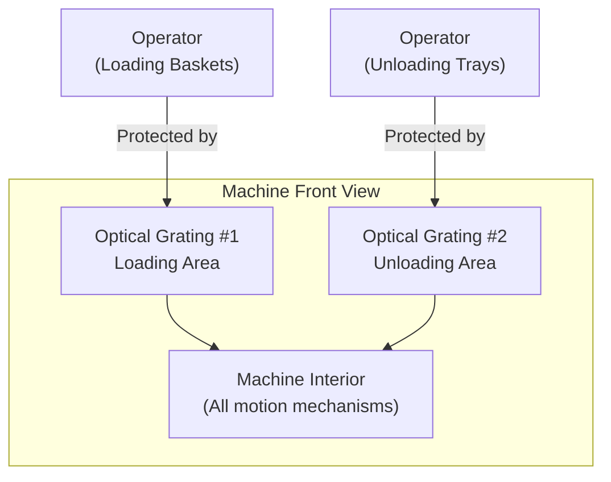
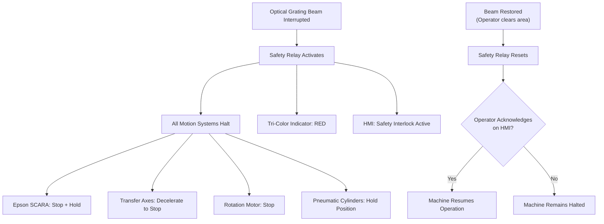
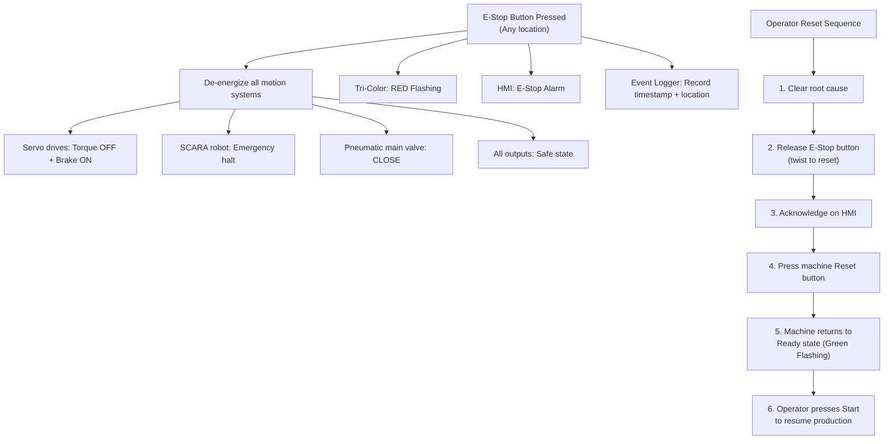
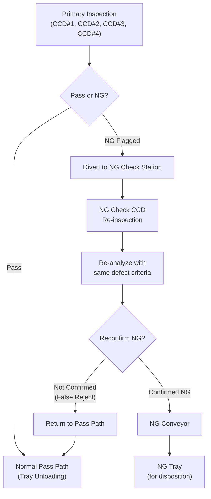
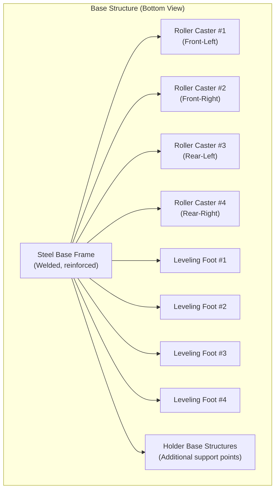
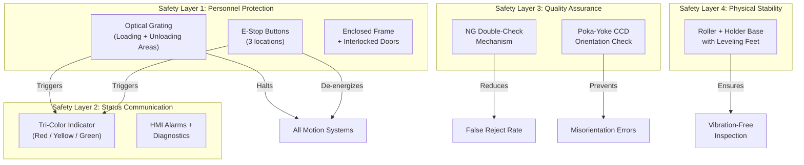

# Safety Design -- AOI for Texas Instruments CSE Semiconductor Products

**Project:** Automated Optical Inspection System for TI CSE Products  
**Built by:** Rongxuan Zhou, Sole Engineer  
**Company:** Dinnar Automation  
**Client:** Texas Instruments  

---

## 1. Safety Design Overview

The AOI system incorporates multiple layers of safety protection to safeguard operators, prevent product damage, and ensure reliable operation at high throughput. The safety architecture addresses three domains: personnel safety (optical grating, E-stop), machine status communication (tri-color indicator), and quality assurance (NG double-check mechanism to prevent false rejects). Physical stability is ensured through the roller and holder base design.

---

## 2. Optical Grating Protection

### 2.1 Purpose

Optical grating (light curtain) systems are installed at the two areas where operators physically interact with the machine: the basket loading area (front-left) and the tray unloading area (front-right). These are the only points where human hands or arms may enter the machine envelope during normal operation.

### 2.2 Installation Locations

### 2.3 Optical Grating Specifications

| Parameter | Specification |
|-----------|---------------|
| Type | Type 4 safety light curtain (per IEC 61496) |
| Protection Height | Sufficient to cover the full opening height at operator access points |
| Beam Spacing | Finger-detection resolution (14 mm or finer) for hand protection |
| Response Time | < 20 ms (typical for Type 4 devices) |
| Connection | Wired to safety relay module with redundant contacts |

### 2.4 Operating Behavior

**Normal operation (beam unbroken):**
- Machine runs at full speed through all 18 process steps.
- Operators can observe the machine through the transparent enclosure panels but do not need to reach into the loading/unloading areas unless loading or unloading material.

**Beam interrupted (operator presence detected):**

1. **Immediate halt:** All motion systems are stopped within the safety relay response time. The Epson SCARA holds its current position, transfer axes decelerate to a controlled stop, and the rotation motor ceases movement.
2. **Pneumatic safe state:** Pneumatic cylinders hold their current positions (valves close to center/exhaust position). Vacuum nozzles maintain vacuum to prevent dropping a unit.
3. **Indicator change:** The tri-color indicator switches to RED (fault/safety interlock).
4. **HMI notification:** A safety interlock message is displayed on the HMI screen.
5. **Restart requires acknowledgment:** After the operator clears the light curtain zone and the beam is restored, the machine does not automatically restart. The operator must acknowledge the safety event on the HMI and press a restart button. This two-step restart protocol prevents unexpected motion when an operator is still near the machine.

### 2.5 Muting Provisions

During normal material loading and unloading operations, the optical grating must allow the operator to reach into the loading/unloading area without triggering a full machine stop for every basket load or tray removal. This is handled by:

- **Zone-limited protection:** The optical grating covers only the opening to the machine interior. The basket magazine and tray output areas are designed so that the operator's hands do not need to pass through the grating plane during normal loading/unloading.
- **Operator-initiated pause:** For operations that require reaching through the grating (such as clearing a jam), the operator presses a dedicated pause button on the HMI to enter a safe manual mode, which stops all motion before the operator reaches in.

---

## 3. Tri-Color Indicator Light

### 3.1 Purpose

A tri-color (red/yellow/green) indicator light tower is mounted on top of the machine enclosure, visible from all directions on the production floor. It provides immediate visual communication of the machine's operating state to operators and supervisors without requiring proximity to the HMI screen.

### 3.2 Indicator States

| Color | Mode | Machine State | Required Action |
|-------|------|---------------|-----------------|
| Green | Steady ON | Normal operation, machine running | None -- production in progress |
| Green | Flashing | Machine idle, ready to start | Operator may start production cycle |
| Yellow | Steady ON | Warning condition active | Operator attention recommended |
| Yellow | Flashing | Material low (basket running out, tray stack almost full) | Operator should prepare to load/unload material |
| Red | Steady ON | Fault condition, machine stopped | Operator must diagnose and clear fault via HMI |
| Red | Flashing | Emergency stop active or safety interlock triggered | Operator must clear safety condition and reset |
| All OFF | -- | Machine powered off or in standby | Power on or wake from standby |

### 3.3 Warning Conditions (Yellow)

The yellow indicator alerts operators to conditions that do not require an immediate stop but need attention to prevent a production interruption:

- **Material low:** Fewer than N baskets remaining in the input magazine, or output tray stack approaching maximum height.
- **NG rate elevated:** The NG rate over the last N units has exceeded a configurable warning threshold, indicating a potential process shift.
- **Maintenance approaching:** A scheduled maintenance interval (e.g., cleaning, calibration check) is approaching based on unit count or elapsed time.
- **Sensor degradation:** A sensor reading is drifting near its acceptable limit (e.g., vacuum level marginal, light intensity below nominal).

### 3.4 Mounting

The indicator tower is mounted on a vertical pole extending above the machine top panel, positioned for 360-degree visibility. The mounting height ensures the indicator is visible above surrounding equipment and racks on a typical semiconductor production floor.

---

## 4. Emergency Stop (E-Stop) Provisions

### 4.1 E-Stop Button Locations

| Location | Position | Rationale |
|----------|----------|-----------|
| Front-left | Adjacent to basket loading area | Immediate access while loading baskets |
| Front-right | Adjacent to tray unloading area | Immediate access while unloading trays |
| Rear panel | Maintenance access side | Accessible during rear maintenance work |

### 4.2 E-Stop Behavior

### 4.3 E-Stop Circuit Design

- **Redundant contacts:** Each E-Stop button uses NC (normally closed) contacts in a redundant (dual-channel) configuration, per safety standards (e.g., ISO 13850).
- **Direct-acting:** The E-Stop circuit is hardwired through safety relays, independent of the main controller software. Even if the controller malfunctions, pressing E-Stop will cut power to motion systems.
- **Non-bypassable:** The E-Stop circuit cannot be overridden by software. It is the highest-priority safety mechanism.
- **Reset protocol:** E-Stop buttons are twist-to-release (mushroom head, latching). Releasing the button does not restart the machine -- a deliberate multi-step reset sequence (detailed above) is required.

---

## 5. NG Double-Check Mechanism

### 5.1 Purpose

At a throughput target of over 85,000 units per day, even a small false reject rate has significant consequences:

| False Reject Rate | False Rejects per Day (at 85K units) | Impact |
|-------------------|---------------------------------------|--------|
| 0.1% | 85 units | Moderate -- rework/reinspection overhead |
| 0.5% | 425 units | Significant -- material waste and labor cost |
| 1.0% | 850 units | Severe -- unacceptable yield loss |

The NG double-check mechanism addresses this by adding a reconfirmation step before any unit is committed to the NG tray.

### 5.2 Mechanism Design

### 5.3 How It Works

1. **Primary inspection flags NG:** Any of the four main CCDs detects a defect exceeding its threshold. The unit is classified as NG with a specific defect category.
2. **Diversion:** Instead of immediately sending the unit to the NG tray, it is diverted to the NG Check CCD reconfirmation station.
3. **Re-inspection:** The NG Check CCD re-captures the image of the flagged unit and re-runs the defect detection algorithm for the specific defect category that was flagged.
4. **Decision:**
   - If the defect is confirmed (re-detected by the NG Check CCD), the unit is committed to the NG tray via the NG conveyor. This is a true NG.
   - If the defect is NOT confirmed (NG Check CCD does not detect the defect), the unit is classified as a false reject and returned to the pass path for tray unloading.
5. **Logging:** All NG Check CCD results (both confirmed and false rejects) are logged with images for offline analysis and threshold refinement.

### 5.4 Benefits

- **Reduces false reject rate:** Catches false positives caused by transient conditions (dust on lens, vibration during capture, momentary illumination fluctuation).
- **Improves effective yield:** Units that pass the reconfirmation are saved from unnecessary rejection, directly improving production yield.
- **Provides data for optimization:** The false reject rate measured at the NG Check CCD station provides feedback for tuning primary inspection thresholds -- if a particular defect category consistently shows high false reject rates, its threshold can be adjusted.
- **Off critical path:** The NG reconfirmation path is separate from the main production flow. NG units are diverted, so the reconfirmation process does not slow down the primary inspection pipeline. The NG Check CCD operates in parallel with continued production on the main line.

### 5.5 Limitations

- The NG Check CCD adds hardware cost (additional camera and station).
- The reconfirmation step adds time for NG units, but since NG units are a small fraction of total throughput, this does not impact overall cycle time.
- Defects that are orientation-dependent (e.g., visible only at a specific angle) may not be reproducible at the reconfirmation station if the unit orientation has changed during diversion. The NG Check station is designed to re-inspect the flagged surface, but some defect types may have lower reconfirmation reliability.

---

## 6. Machine Stability: Roller and Holder Base

### 6.1 Purpose

Precision vision inspection is sensitive to machine vibration and tilting. The base design ensures that the machine remains stable and level during operation, even on imperfect factory floors.

### 6.2 Design Details

### 6.3 Roller Casters

- **Function:** Allow the machine to be rolled into position during installation and layout changes.
- **Locking mechanism:** Each roller caster has a wheel lock to prevent unintended movement.
- **Load rating:** Each caster is rated for at least 1/4 of the total machine weight with safety margin.
- **During operation:** Once positioned, the leveling feet are deployed and the rollers are not load-bearing. This isolates the machine from floor vibrations transmitted through the rollers.

### 6.4 Adjustable Leveling Feet

- **Function:** Provide a stable, level foundation on uneven factory floors.
- **Adjustment range:** Typically +/- 20 mm of vertical adjustment per foot.
- **Lock nuts:** Once leveled, lock nuts are tightened to prevent the leveling feet from drifting.
- **Leveling procedure:** A precision spirit level is placed on the machine base plate. Each leveling foot is adjusted until the machine is level in both X and Y axes within 0.1 mm/m.

### 6.5 Holder Base Structures

- **Function:** Additional support points on the base frame that distribute the machine weight more evenly and prevent frame deflection.
- **Design:** Welded steel brackets or plates that provide intermediate support between the corner leveling feet.
- **Benefit:** Reduces the maximum span between support points, minimizing base plate flex that could transmit vibrations to the camera mounting structures.

---

## 7. Safety System Integration Summary

---

## 8. Compliance Considerations

While specific compliance certifications depend on the target market and customer requirements, the safety design follows principles aligned with:

| Standard | Relevance |
|----------|-----------|
| ISO 13849 (Safety of machinery -- Safety-related parts of control systems) | E-stop circuit design, safety relay architecture |
| IEC 61496 (Safety of machinery -- Electro-sensitive protective equipment) | Optical grating (light curtain) selection and installation |
| ISO 13850 (Safety of machinery -- Emergency stop function) | E-stop button type, placement, and reset protocol |
| ISO 12100 (Safety of machinery -- General principles for design) | Overall safety risk assessment methodology |

Final compliance certification and CE/SEMI marking (if required) would be pursued as part of the production deployment phase.
