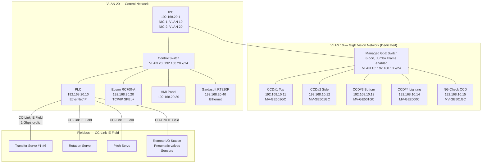
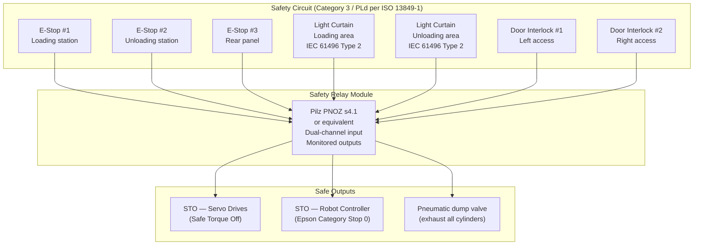
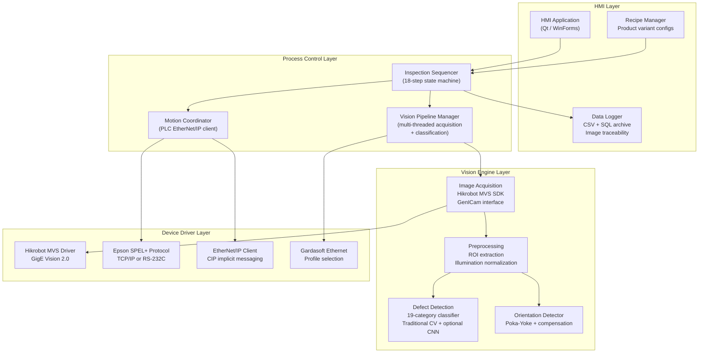

# System Architecture

## 1. Machine Physical Specifications

| Parameter | Value |
|-----------|-------|
| Overall Dimensions (L x W x H) | 1800 x 1600 x 2000 mm |
| Frame Construction | Welded steel base plate + aluminum extrusion enclosure frame |
| Base Support | Heavy-duty roller casters with 4x adjustable leveling feet (M16 thread) |
| Weight | Approx. 1200 kg (fully loaded) |
| Access | Front-loading operator interface, rear maintenance panel with interlocked doors |
| Facility Requirements | AC 220V/380V 3-phase, 0.4-0.6 MPa compressed air, -0.06 MPa vacuum |

---

## 2. Controller Hierarchy

The system follows a three-tier industrial automation architecture compliant with ISA-95 / IEC 62264:

```
Level 2  ─ Supervisory ──────────────────────────────────────────
           │  Industrial PC (IPC)
           │  - Vision pipeline orchestration
           │  - Recipe management and HMI server
           │  - MES interface (future-ready)
           │
Level 1  ─ Cell Control ─────────────────────────────────────────
           │  Motion Controller / PLC
           │  - 18-step sequence state machine
           │  - I/O scan cycle: 2 ms deterministic
           │  - Pneumatic valve sequencing
           │  - Safety logic (SIL 2 capable)
           │
           │  Epson RC+ Robot Controller
           │  - 4-DOF SCARA motion planning
           │  - Dual vacuum nozzle end-effector I/O
           │  - Built-in I/O for gripper + sensor
           │
           │  Gardasoft RT820F-20 Lighting Controller
           │  - 4-channel programmable strobe
           │  - Hardware trigger synchronized
           │  - Per-channel current/duration profiles
           │
Level 0  ─ Field Devices ───────────────────────────────────────
              - 4x Hikrobot GigE cameras
              - 6x Transfer linear actuators (servo/stepper)
              - 1x 360-deg rotation servo motor
              - Pneumatic solenoid valve manifold (SMC SY series)
              - Vacuum generators + ejectors
              - Proximity / photoelectric sensors
              - Optical grating (light curtain)
              - E-Stop relays (safety-rated)
```

### 2.1 Industrial PC (IPC)

| Parameter | Specification |
|-----------|--------------|
| Platform | Advantech IPC-610 or equivalent rackmount |
| CPU | Intel Core i7-12700 (12C/20T) |
| RAM | 32 GB DDR4 |
| Storage | 512 GB NVMe SSD (OS + App) + 2 TB HDD (image archive) |
| OS | Windows 10 IoT Enterprise LTSC 2021 |
| Network | 2x Intel GbE (1x GigE Vision dedicated, 1x control/HMI) |
| GPU | NVIDIA T400 4GB (optional, for CNN-based defect detection) |
| Vision SDK | Hikrobot MVS 4.x (GenICam / GigE Vision 2.0 compliant) |

### 2.2 Motion Controller / PLC

| Parameter | Specification |
|-----------|--------------|
| Platform | Keyence KV-8000 or Mitsubishi iQ-R Series |
| I/O Scan Cycle | 2 ms (deterministic) |
| Digital I/O | 128 DI + 96 DO |
| Analog I/O | 8 AI + 4 AO (pressure, vacuum monitoring) |
| Communication | EtherNet/IP (to IPC), CC-Link IE Field (to servo drives), RS-232C (to Epson) |
| Motion Control | 8-axis positioning (6 transfer + 1 rotation + 1 pitch) |
| Safety CPU | Integrated safety controller (SIL 2 / PLd per ISO 13849-1) |

### 2.3 Epson SCARA Robot Controller

| Parameter | Specification |
|-----------|--------------|
| Controller | Epson RC700-A |
| Robot | Epson T6-602S (or equivalent 4-DOF SCARA) |
| Reach | 600 mm |
| Repeatability | +/- 0.02 mm |
| End-Effector | Custom dual vacuum nozzle (1st bottom-suction + 2nd top-suction) |
| Communication | TCP/IP Ethernet (SPEL+ remote command) or RS-232C (SPEL+ command protocol) |
| I/O | 16 DI / 16 DO directly wired to PLC for handshake signals |

---

## 3. Communication Architecture

### 3.1 Network Topology



### 3.2 Protocol Stack Summary

| Layer | Protocol | Purpose | Devices | Cycle / Latency |
|-------|----------|---------|---------|-----------------|
| Vision | GigE Vision 2.0 (UDP) | Image acquisition + camera control | CCD#1-#4, NG CCD | Hardware-triggered, ~5 ms transfer per frame (5MP) |
| Vision Config | GenICam GenTL | Camera parameter access (exposure, gain, ROI, trigger) | All cameras | On-demand |
| Robot Command | TCP/IP SPEL+ Protocol | SCARA motion commands + status query | Epson RC700-A | ~10 ms round-trip |
| Robot Handshake | Hardwired 24V DI/DO | Cycle start, busy, complete, error signals | Epson via PLC | <1 ms (direct wire) |
| PLC ↔ IPC | EtherNet/IP (CIP) | Inspection results, recipe download, trigger commands | PLC ↔ IPC | 10 ms implicit messaging |
| Fieldbus | CC-Link IE Field | Servo position commands, I/O cyclic data | Servo drives, remote I/O | 0.5 ms cyclic (1 Gbps) |
| Lighting | Ethernet + Hardware Trigger | Strobe profile selection, trigger sync | Gardasoft RT820F-20 | <100 us trigger-to-light |
| Safety | Safety-rated hardwired | E-Stop, light curtain, door interlocks | Safety relay module | <10 ms response (Category 3) |
| HMI | HTTP / WebSocket | Operator interface, live camera feed | IPC → HMI Panel | Non-critical |

### 3.3 GigE Vision Protocol Details

The system uses **GigE Vision 2.0** over a dedicated VLAN with the following optimizations:

- **Jumbo Frames**: MTU set to 9000 bytes on the dedicated switch and NIC to reduce CPU interrupt rate during image transfer
- **Packet Resend**: Enabled with 100 ms timeout; resend rate monitored as image quality indicator
- **Inter-Packet Delay**: Configured per-camera to prevent bus contention when multiple cameras fire within the same cycle
- **Hardware Trigger Mode**: All cameras configured for Line 0 hardware trigger input — trigger signal is generated by the PLC synchronized to transfer axis position, ensuring image acquisition occurs at the exact inspection position
- **Bandwidth Allocation**: 5 cameras x 5 MP x 8-bit = ~25 MB/frame; at 1 Hz effective rate per camera, total bandwidth is ~200 Mbps, well within GbE capacity. CCD#4 at 20 MP requires ~20 MB per frame

| Camera | Resolution | Pixel Size | Frame Size | Trigger Source |
|--------|-----------|------------|-----------|----------------|
| CCD#1 | 2448 x 2048 (5 MP) | 3.45 um | ~5 MB | PLC DO → Camera Line 0 |
| CCD#2 | 2448 x 2048 (5 MP) | 3.45 um | ~5 MB x 36 frames | PLC DO → Camera Line 0 (per 10-deg step) |
| CCD#3 | 2448 x 2048 (5 MP) | 3.45 um | ~5 MB | PLC DO → Camera Line 0 (during Transfer #2 motion) |
| CCD#4 | 5472 x 3648 (20 MP) | 2.4 um | ~20 MB | PLC DO → Camera Line 0 (after shade close confirmed) |
| NG CCD | 2448 x 2048 (5 MP) | 3.45 um | ~5 MB | PLC DO → Camera Line 0 |

### 3.4 Lighting Controller Protocol

The **Gardasoft RT820F-20** strobe controller provides 4 independently programmable channels with nanosecond-precision trigger response:

| Channel | Light Source | Camera | Drive Current | Strobe Duration |
|---------|-------------|--------|---------------|-----------------|
| CH1 | DN-COS60-W (Coaxial) | CCD#1 Top | 800 mA | 200 us |
| CH2 | DN-2BS32738-W (Bar x2) | CCD#2 Side | 1200 mA | 150 us |
| CH3 | DN-COS60-W (Coaxial) | CCD#3 Bottom | 800 mA | 200 us |
| CH4 | DN-HSP25-W (Hyper Spot) | CCD#4 Lighting | 2000 mA | 500 us |

- **Trigger Mode**: Each channel fires on its own hardware trigger input (from PLC), synchronized with the corresponding camera trigger
- **Multi-Profile**: Each channel stores up to 8 illumination profiles (power/duration combinations), selectable at runtime for different CSE product variants via EtherNet/IP recipe download
- **Overdrive**: Strobe mode allows 3-5x continuous current rating for short pulses, enabling higher illuminance without thermal limits

---

## 4. Hardware Topology and Equipment Layout

### 4.1 Station Layout (18 Numbered Stations)

```
    ┌──────────────────────────────────────────────────────────────────┐
    │                   Machine Enclosure (Top View)                   │
    │  1800 mm x 1600 mm                                               │
    │                                                                   │
    │  ┌─────┐  ┌─────┐  ┌───────┐  ┌─────┐  ┌──────┐  ┌──────┐     │
    │  │  1  │→ │  2  │→ │   3   │→ │  4  │→ │  5   │→ │  6   │     │
    │  │Load │  │Feed │  │ SCARA │  │Pitch│  │Xfer1 │  │CCD#4 │     │
    │  │Bskt │  │Mech │  │ Robot │  │Chng │  │      │  │Light │     │
    │  └─────┘  └─────┘  └───────┘  └─────┘  └──────┘  └──────┘     │
    │                                                                   │
    │  ┌─────┐  ┌─────┐  ┌─────┐  ┌──────┐  ┌──────┐  ┌──────┐     │
    │  │  8  │← │  7  │← │  ←  │  │  9   │→ │  10  │→ │  11  │     │
    │  │Bskt │  │CCD#3│  │Xfer2│  │Ori.  │  │ Pos  │  │CCD#2 │     │
    │  │Coll │  │Botm │  │     │  │Comp  │  │      │  │Side  │     │
    │  └─────┘  └─────┘  └─────┘  └──────┘  └──────┘  └──────┘     │
    │                     ┌─────┐                                      │
    │                     │CCD#1│ (Top check between Xfer2→Xfer3)     │
    │                     └─────┘                                      │
    │  ┌──────┐  ┌──────┐  ┌──────┐  ┌──────┐  ┌──────┐             │
    │  │  16  │  │  15  │← │  14  │← │  13  │← │  12  │             │
    │  │Tray  │  │Man.  │  │Stack │  │Unlod │  │Xfer5 │             │
    │  │Feed  │  │Unlod │  │      │  │Tray  │  │      │             │
    │  └──────┘  └──────┘  └──────┘  └──────┘  └──────┘             │
    │                                                                   │
    │  ┌──────────────────┐                    ┌────┐  ┌────┐         │
    │  │ NG Path          │                    │ 17 │→ │ 18 │         │
    │  │ [NG CCD] → [Conv]│                    │Conv│  │NG  │         │
    │  └──────────────────┘                    │    │  │Tray│         │
    │                                           └────┘  └────┘         │
    │                                                                   │
    │  [HMI]  [E-Stop x3]  [Tri-Color]  [Optical Grating x2]        │
    └──────────────────────────────────────────────────────────────────┘
```

---

## 5. I/O Architecture

### 5.1 Digital I/O Allocation

| Group | Signals | Points | Direction |
|-------|---------|--------|-----------|
| Camera Triggers | CCD#1-#4 trigger, NG CCD trigger | 5 | DO |
| Camera Ready | CCD#1-#4 acquisition complete | 5 | DI |
| Robot Handshake | Start, busy, done, error, vacuum confirm x2, nozzle select | 8 DI + 4 DO | Mixed |
| Transfer Axes | Home sensor, limit+, limit-, in-position (x6 axes) | 24 DI | DI |
| Transfer Commands | Axis enable, direction (x6 axes) | 12 DO | DO |
| Pneumatic Valves | Basket feed (3), pitch change (4), gripper (6), shade (2), vacuum (4) | 19 DO | DO |
| Vacuum Sensors | Vacuum confirm for each suction point | 8 DI | DI |
| Rotation Motor | Enable, in-position, home, 10-deg step trigger | 3 DI + 2 DO | Mixed |
| Safety | E-Stop x3, light curtain x2, door interlock x2 | 7 DI (safety-rated) | DI |
| Indicators | Tri-Color (R/Y/G), buzzer | 4 DO | DO |
| NG Conveyor | Motor run, position sensor, holder bar | 2 DI + 2 DO | Mixed |
| **Total** | | **~128 DI + ~48 DO** | |

### 5.2 Pneumatic Valve Manifold

SMC SY3000 series solenoid valve manifold, 24V DC:

| Valve | Function | Type | Flow |
|-------|----------|------|------|
| V1-V3 | Basket feeding: stack hold, L-trigger, lifter | 5/2 single solenoid | 200 L/min |
| V4-V5 | Pitch change: e-cylinder extend/retract | 5/2 double solenoid | 300 L/min |
| V6-V7 | Pitch change: blue holder clamp/release, 180-deg flip | 5/2 single solenoid | 200 L/min |
| V8-V9 | Shade close/open (CCD#4 closed chamber) | 5/2 double solenoid | 100 L/min |
| V10-V15 | Transfer gripper vacuum on/off (x6 stations) | 3/2 normally closed | N/A (vacuum) |
| V16-V19 | Pitch change platform vacuum (x4 positions) | 3/2 normally closed | N/A (vacuum) |

---

## 6. Safety Architecture

### 6.1 Safety System Diagram



### 6.2 Safety Standards Compliance

| Standard | Requirement | Implementation |
|----------|-------------|----------------|
| ISO 13849-1 | Performance Level d (PLd) | Dual-channel safety relay, Category 3 architecture |
| IEC 61496 | Electro-sensitive protective equipment | Type 2 light curtain at operator access points |
| ISO 13850 | Emergency stop design | Red mushroom-head, positive-action NC contacts, manual reset required |
| ISO 12100 | General risk assessment | Documented risk assessment per machine directive |
| ISO 14120 | Guards and protective devices | Interlocked doors, polycarbonate panels |

---

## 7. Real-Time Cycle Analysis

### 7.1 Timing Budget (per 4-unit cycle)

Target: >85,000 units/day = >3,542 units/hour = ~1.02 seconds per unit = **~4.07 seconds per 4-unit cycle**

| Phase | Duration | Overlap |
|-------|----------|---------|
| SCARA pick 4 CSE from basket | 1.2 s | Concurrent with previous cycle's CCD#2 side check |
| Pitch change + positioning | 0.8 s | Concurrent with SCARA return-to-home |
| Transfer #1 to CCD#4 station | 0.3 s | — |
| CCD#4 shade close + acquisition + analysis | 0.6 s | — |
| Transfer #2 (CCD#3 bottom check during motion) | 0.4 s | CCD#3 acquisition during transfer motion |
| CCD#1 top check | 0.3 s | — |
| Orientation compensation + positioning | 0.4 s | — |
| CCD#2 side check (360-deg rotation, 36 frames) | 1.0 s | Concurrent with next cycle's SCARA pick |
| Transfer #5 to unloading | 0.3 s | — |
| Tray placement | 0.2 s | — |
| **Total sequential** | **~5.5 s** | |
| **Pipelined effective** | **~3.8 s** | 2 stations overlap with next cycle |

Effective throughput: 4 units / 3.8 s = **~3,789 units/hour = ~90,947 units/day** (exceeds 85K target with margin).

---

## 8. Software Architecture



### 8.1 Vision Pipeline Threading Model

```
Main Thread          Camera Thread x5       Classification Thread x4
─────────────        ─────────────────      ─────────────────────────
Sequencer loop  →    Wait for trigger  →    Pull frame from queue
  ↓                  Acquire frame          Run per-CCD detector
  Send trigger       Push to queue          Return InspectionResult
  ↓                  Signal ready           ↓
  Wait for result ←──────────────────────── Aggregate all 4 CCDs
  ↓                                         Apply NG double-check
  Route OK/NG
```

- **5 camera threads** (CCD#1-#4 + NG CCD): Each blocks on hardware trigger, then acquires and enqueues
- **4 classification threads**: Each CCD's defect detection runs in its own thread to maximize parallelism
- **1 main sequencer thread**: Coordinates triggers, waits for aggregated results, makes pass/fail decision

---

## 9. Power Distribution

| Circuit | Voltage | Breaker | Load |
|---------|---------|---------|------|
| Main Power | 380V 3-phase | 32A MCCB | Total machine supply |
| IPC + Vision | 220V single-phase | 16A MCB | IPC, cameras, switch, lighting controller |
| Robot Controller | 220V single-phase | 16A MCB | Epson RC700-A |
| Servo Drives | 220V single-phase | 16A MCB | 8 servo drives (CC-Link IE Field) |
| 24V DC Supply | 24V DC (Mean Well NDR-480-24) | 20A | PLC, I/O modules, solenoid valves, sensors |
| Pneumatic | 0.4-0.6 MPa | N/A | SMC FRL + valve manifold + vacuum generators |
| Safety Circuit | 24V DC (dedicated) | 10A | Safety relay, E-Stop, light curtains (galvanically isolated) |
