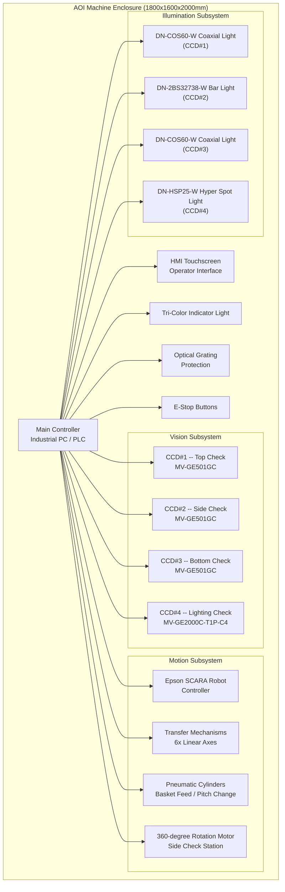
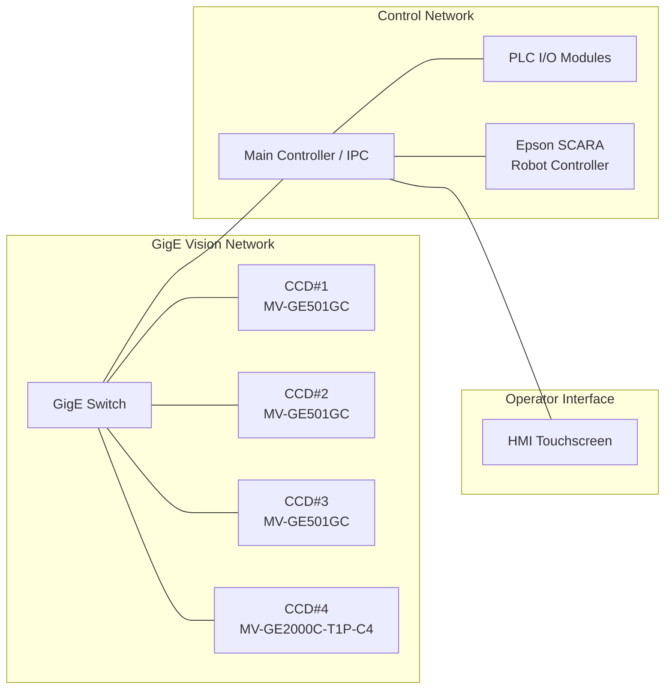
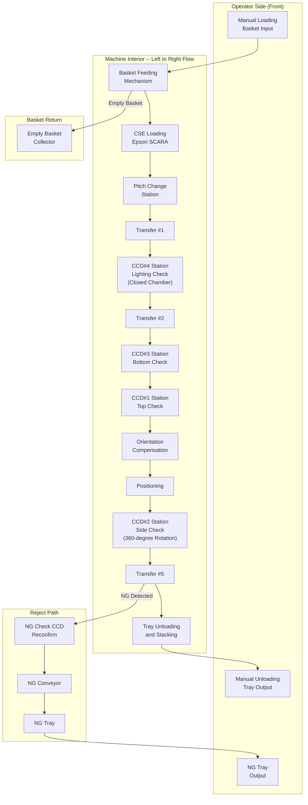
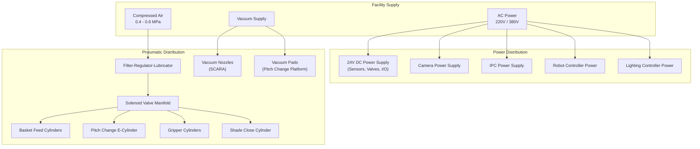
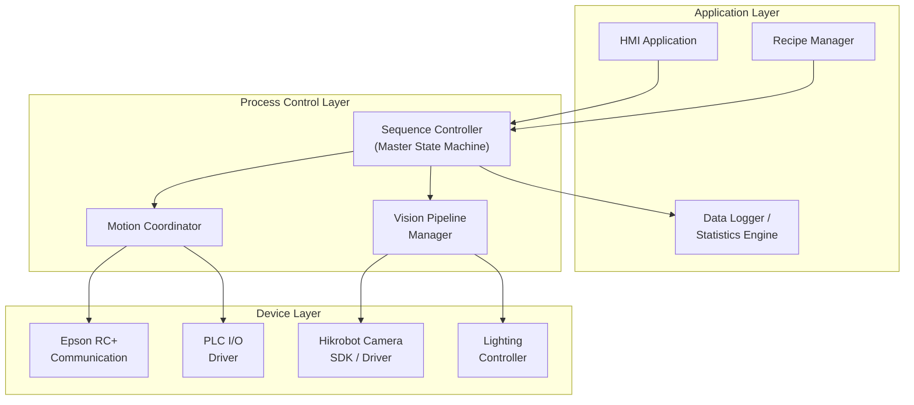

# System Architecture -- AOI for Texas Instruments CSE Semiconductor Products

**Project:** Automated Optical Inspection System for TI CSE Products  
**Built by:** Rongxuan Zhou, Sole Engineer  
**Company:** Dinnar Automation  
**Client:** Texas Instruments  

---

## 1. Machine Physical Specifications

| Parameter | Value |
|-----------|-------|
| Overall Dimensions (L x W x H) | 1800 mm x 1600 mm x 2000 mm |
| Frame Construction | Aluminum extrusion frame with steel base plate |
| Base Support | Roller casters with adjustable leveling feet and holder base for stability |
| Access | Front-loading operator interface with protective enclosure |

---

## 2. High-Level System Architecture

---

## 3. Network Topology

All four Hikrobot cameras communicate with the main controller over GigE Vision protocol via a dedicated Gigabit Ethernet switch, ensuring deterministic image transfer with minimal latency. The Epson SCARA robot controller connects to the main controller via dedicated communication link (RS-232 / Ethernet, per Epson RC+ configuration). PLC I/O modules handle all pneumatic valve control, sensor inputs, and actuator outputs.

---

## 4. Hardware Topology and Equipment Layout

---

## 5. Electrical Architecture

### 5.1 Main Controller

The main controller is an industrial PC (IPC) running the vision inspection software and master process orchestration logic. It coordinates all subsystems through:

- **GigE Vision interface** to all four Hikrobot cameras
- **Digital I/O** via PLC modules for pneumatic valve control, sensor readback, and actuator commands
- **Communication link** to the Epson SCARA robot controller for pick-and-place sequencing
- **HMI interface** for operator interaction, recipe management, and result display

### 5.2 Epson SCARA Robot Controller

The Epson SCARA robot is controlled by its dedicated Epson RC+ controller, which receives high-level motion commands from the main controller. The robot performs:

- CSE pick-up from the basket feeding station using dual vacuum nozzles
- Poka-Yoke orientation verification via CCD check before placement
- 90-degree rotation for correct orientation
- Placement of 4 units per cycle onto the pitch change platform

### 5.3 Camera System (4x Hikrobot Cameras)

| Camera ID | Model | Purpose | Interface |
|-----------|-------|---------|-----------|
| CCD#1 | MV-GE501GC | Top surface inspection | GigE Vision |
| CCD#2 | MV-GE501GC | Side / pin inspection (360-degree) | GigE Vision |
| CCD#3 | MV-GE501GC | Bottom surface inspection | GigE Vision |
| CCD#4 | MV-GE2000C-T1P-C4 | Lighting check (functional) | GigE Vision |

### 5.4 HMI (Human-Machine Interface)

The HMI touchscreen provides:

- Real-time production status display (throughput, pass/fail counts, yield)
- Recipe selection and parameter adjustment
- Alarm history and diagnostics
- Manual/jog mode for maintenance and setup
- Camera live view and inspection result review

---

## 6. Safety Features

### 6.1 Optical Grating Protection

Optical grating (light curtain) sensors are installed at the manual loading and unloading areas. When an operator's hand or body breaks the light curtain beam during machine operation, the system immediately:

1. Halts all motion axes (robot, transfer, rotation motor)
2. Closes pneumatic valves to safe state
3. Triggers a fault alarm on the Tri-Color indicator
4. Requires operator acknowledgment before restart

This prevents injury from moving mechanical components while operators load baskets or unload trays.

### 6.2 Tri-Color Indicator Light

| Color | State | Meaning |
|-------|-------|---------|
| Green | Steady | Normal operation / Running |
| Yellow | Steady or Flashing | Warning condition (e.g., low material, approaching maintenance interval) |
| Red | Steady or Flashing | Fault / Emergency stop active / Intervention required |

The indicator tower is mounted on top of the machine enclosure for visibility from across the production floor.

### 6.3 Emergency Stop (E-Stop)

Multiple E-Stop mushroom-head buttons are located at:

- The operator loading station (front-left)
- The operator unloading station (front-right)
- The rear maintenance panel

Pressing any E-Stop button immediately de-energizes all motion systems and engages pneumatic brakes where applicable. The system enters a safe hold state and requires a deliberate reset sequence before resuming operation.

### 6.4 Enclosed Machine Frame

The machine is fully enclosed with transparent polycarbonate panels where visual access is needed, and interlocked access doors for maintenance. Door interlocks prevent operation when any access panel is open.

---

## 7. Power and Pneumatic Architecture

---

## 8. Software Architecture Overview

The master state machine in the sequence controller orchestrates all process steps, coordinating vision acquisition triggers with mechanical motion to minimize cycle time. The vision pipeline manager handles image acquisition, preprocessing, defect detection, and classification for all four CCD stations in a pipelined fashion, allowing inspection at one station to overlap with mechanical transfer at another.

---

## 9. Summary

This AOI system integrates precision mechanical handling (Epson SCARA robot, 6-axis linear transfer, pitch-change mechanism), a 4-camera Hikrobot vision subsystem with specialized illumination, and comprehensive safety features into a compact 1800 x 1600 x 2000 mm footprint. The architecture is designed to sustain a throughput target exceeding 85,000 units per day with sub-1-second cycle time per unit, while maintaining 100% detection coverage across all 19 defined defect categories for TI CSE semiconductor products.
