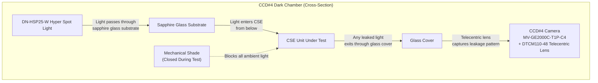
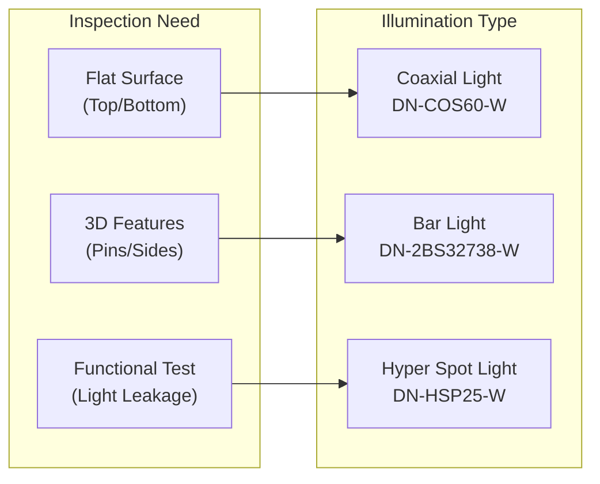
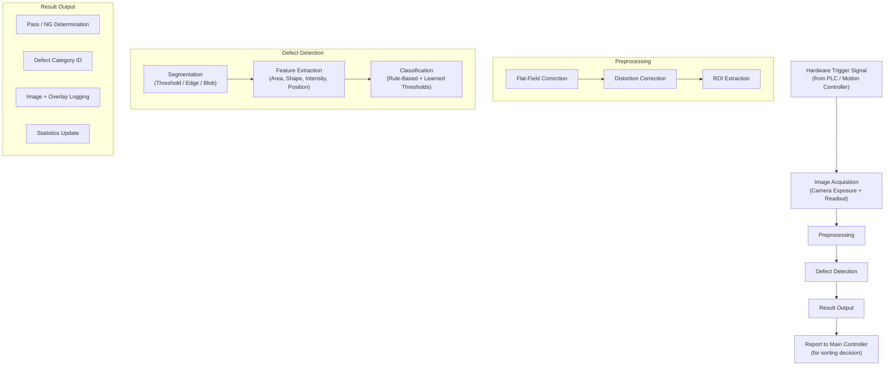

# Vision System -- AOI for Texas Instruments CSE Semiconductor Products

**Project:** Automated Optical Inspection System for TI CSE Products  
**Built by:** Rongxuan Zhou, Sole Engineer  
**Company:** Dinnar Automation  
**Client:** Texas Instruments  

---

## 1. Vision System Overview

The AOI system employs a 4-CCD machine vision architecture using Hikrobot industrial cameras. Three cameras (CCD#1, CCD#2, CCD#3) share identical sensor/lens configurations for top, side, and bottom surface inspection. The fourth camera (CCD#4) uses a higher-resolution sensor with a telecentric lens for the functional lighting check in a sealed dark chamber. Together, the four cameras provide 100% coverage of all inspectable surfaces and the functional light-leakage test.

---

## 2. CCD Configuration Summary

| Parameter | CCD#1 (Top) | CCD#2 (Side) | CCD#3 (Bottom) | CCD#4 (Lighting) |
|-----------|-------------|--------------|-----------------|-------------------|
| **Camera Model** | MV-GE501GC | MV-GE501GC | MV-GE501GC | MV-GE2000C-T1P-C4 |
| **Lens** | WWK03-110-230 | WWK03-110-230 | WWK03-110-230 | DTCM110-48 (Telecentric) |
| **Illumination** | DN-COS60-W (Coaxial) | DN-2BS32738-W (Bar) | DN-COS60-W (Coaxial) | DN-HSP25-W (Hyper Spot) |
| **Resolution (mm/px)** | 0.0115 | 0.0115 | 0.0115 | 0.0069 |
| **Field of View (mm)** | 28 x 24 | 28 x 24 | 28 x 24 | 37.9 x 25.3 |
| **Working Distance (mm)** | 110 +/- 2 | 110 +/- 2 | 110 +/- 2 | 140 +/- 3 |
| **Inspection Type** | Cosmetic + Assembly | Assembly (pins) | Cosmetic + Function | Functional (Light Leakage) |

---

## 3. Detailed CCD Specifications

### 3.1 CCD#1 -- Top Surface Inspection

```
Camera:       MV-GE501GC (Hikrobot, 5MP, GigE Vision, Color)
Lens:         WWK03-110-230 (Fixed focal length macro lens)
Light:        DN-COS60-W (60mm coaxial ring light, white)
Resolution:   0.0115 mm/pixel
FOV:          28 mm x 24 mm
WD:           110 mm +/- 2 mm
Mounting:     Vertical, looking downward onto top surface
```

**Defects Detected:**
- **Top side surface defects** -- Scratches, contamination, staining, discoloration on the top ceramic or metal lid surface
- **Marking codes** -- Missing marking (No code), blurred or illegible marking (Code blur), incorrect marking
- **Misalignment** -- CSE package body misalignment relative to expected position (critical defect)

**Illumination Strategy:**  
The DN-COS60-W coaxial light provides uniform, shadow-free illumination perpendicular to the top surface. Coaxial illumination is specifically chosen for flat, reflective surfaces (ceramic/metal lids) because it eliminates specular angle-dependent artifacts and provides consistent contrast for both surface defect detection and printed code reading. The coaxial geometry ensures that light reflected from the flat surface returns directly to the camera, while surface irregularities (scratches, contamination) scatter light away, creating high-contrast defect signatures.

---

### 3.2 CCD#2 -- Side / Pin Inspection

```
Camera:       MV-GE501GC (Hikrobot, 5MP, GigE Vision, Color)
Lens:         WWK03-110-230 (Fixed focal length macro lens)
Light:        DN-2BS32738-W (Dual bar light, white)
Mounting:     Horizontal, viewing the side profile
Rotation:     360-degree motor rotation of CSE unit during capture
```

**Defects Detected:**
- **Pin bent** -- Lead pins deformed outside coplanarity tolerance
- **Pin oxidized** -- Discoloration or oxidation on lead pin surfaces
- **Pin bur** -- Burrs or excess material on pin edges (requires real production samples for validation)
- **Pin mis-cut** -- Pins cut to incorrect length or with irregular trim profiles (requires real production samples for validation)
- **Gold exposure** -- Exposed gold bonding wire or pad visible from side view where it should be encapsulated

**Illumination Strategy:**  
The DN-2BS32738-W dual bar light is positioned to provide grazing-angle illumination along the pin row. Bar lights produce directional illumination that emphasizes three-dimensional features such as bent pins (which cast shadows at different angles than straight pins), burrs (which create bright spots from specular reflection at irregular facets), and oxidation (which alters surface reflectivity). The dual-bar configuration illuminates from two opposing angles to ensure all pin surfaces are visible regardless of rotation angle.

**360-Degree Rotation Capture:**  
The CSE unit is gripped and lifted by a mechanical gripper, then rotated by a precision motor through a full 360 degrees. CCD#2 captures multiple frames during rotation (either at discrete angular intervals such as every 90 degrees for each pin row, or as a continuous sweep with triggered acquisition). This ensures complete inspection of all pins on all four sides of the package.

---

### 3.3 CCD#3 -- Bottom Surface Inspection

```
Camera:       MV-GE501GC (Hikrobot, 5MP, GigE Vision, Color)
Lens:         WWK03-110-230 (Fixed focal length macro lens)
Light:        DN-COS60-W (60mm coaxial ring light, white)
Resolution:   0.0115 mm/pixel
FOV:          28 mm x 24 mm
WD:           110 mm +/- 2 mm
Mounting:     Vertical, looking upward at bottom surface
Timing:       Captures during Transfer #2 motion (pipelined)
```

**Defects Detected:**
- **Bottom surface defects** -- Scratches, marks, contamination on the bottom ceramic surface
- **Epoxy issues** -- Epoxy exposure (adhesive visible where it should not be), insufficient epoxy coverage, epoxy higher than ceramic edge
- **Cracks** -- Hairline or visible cracks in the ceramic substrate (critical defect)
- **Broken** -- Chipped or fractured ceramic body (critical defect)

**Illumination Strategy:**  
Identical to CCD#1, the DN-COS60-W coaxial light provides uniform bottom-surface illumination. The upward-facing camera captures the bottom surface as the unit passes overhead during Transfer #2, which is the key cycle-time optimization -- bottom inspection happens during transfer, not as a separate stopped step. The coaxial geometry is essential for detecting cracks, which appear as dark lines on the otherwise uniformly bright ceramic surface.

---

### 3.4 CCD#4 -- Lighting Check (Functional Test)

```
Camera:       MV-GE2000C-T1P-C4 (Hikrobot, 20MP, GigE Vision, Color)
Lens:         DTCM110-48 (Telecentric lens, 110mm focal length)
Light:        DN-HSP25-W (Hyper spot light, white, high intensity)
Resolution:   0.0069 mm/pixel
FOV:          37.9 mm x 25.3 mm
WD:           140 mm +/- 3 mm
Mounting:     Vertical, enclosed in sealed dark chamber
Chamber:      Sapphire glass substrate + glass cover, mechanical shade
```

**Defects Detected:**
- **Light leakage** -- Functional test, not cosmetic. Detects any path through the CSE glass structure where light leaks through unintended locations.

**Why This CCD is Different:**

CCD#4 serves a fundamentally different purpose from the other three cameras. While CCD#1 through CCD#3 perform cosmetic and assembly inspection (looking for visible defects on surfaces), CCD#4 performs a functional test: it determines whether the CSE package's optical structure is intact by checking for light leakage.

**Closed Chamber Design:**



1. The mechanical shade closes to create a completely dark environment, eliminating ambient light interference.
2. The DN-HSP25-W hyper spot light illuminates the CSE from below through a sapphire glass substrate (sapphire chosen for its optical clarity, flatness, and durability).
3. Light passes through the CSE glass structure from the bottom.
4. If there is any leakage path (cracks in glass, seal failures, structural defects), light exits through the top glass cover.
5. The MV-GE2000C-T1P-C4 with telecentric lens captures any leakage from above through the glass cover.
6. Telecentric optics ensure consistent magnification and eliminate perspective distortion, which is critical for quantifying leakage location and intensity.

**Why Higher Resolution:**  
The 20MP sensor (0.0069 mm/pixel) is used because light leakage defects can be extremely small -- a hairline crack in the glass structure may produce only a few pixels of bright signal against the dark background. The higher resolution and larger FOV (37.9 x 25.3 mm) ensure that even the smallest leakage paths are captured with sufficient pixel coverage for reliable detection.

---

## 4. Illumination Strategy

### 4.1 Illumination Selection Rationale



| Light Type | Application | Key Advantage |
|------------|-------------|---------------|
| Coaxial (DN-COS60-W) | CCD#1 top, CCD#3 bottom | Shadow-free uniform illumination on flat reflective surfaces; maximizes contrast for surface defects and printed codes |
| Bar (DN-2BS32738-W) | CCD#2 side | Directional grazing illumination emphasizes 3D pin features (bends, burrs, oxidation); dual-bar covers all angles during rotation |
| Hyper Spot (DN-HSP25-W) | CCD#4 lighting check | High-intensity concentrated beam for through-illumination of glass structures; sufficient power to reveal even minimal leakage paths |

### 4.2 Lighting Controller

All light sources are controlled via a dedicated lighting controller that supports:

- **Strobe mode** -- Synchronized pulsed illumination triggered by camera acquisition signal, enabling high-intensity short-duration flashes that freeze motion blur during Transfer #2 bottom capture
- **Intensity control** -- Per-channel brightness adjustment stored in product recipes
- **Continuous mode** -- Available for setup, calibration, and live preview via HMI

---

## 5. Calibration Approach

### 5.1 Spatial Calibration

Each CCD station requires spatial calibration to establish the mapping from pixel coordinates to physical (millimeter) coordinates:

1. **Calibration target** -- A precision dot grid or checkerboard pattern with known spacing is placed at the working distance of each camera.
2. **Image acquisition** -- Multiple images are captured at different positions (if necessary, for cameras mounted on motion stages).
3. **Intrinsic parameters** -- Lens distortion coefficients are computed and stored for real-time correction.
4. **Scale factor verification** -- The computed mm/pixel value is verified against the specified resolution (0.0115 mm/px for CCD#1-3, 0.0069 mm/px for CCD#4).

For CCD#4 with the telecentric lens, spatial calibration is simplified because telecentric optics have no perspective distortion -- the scale factor is constant across the entire field of view.

### 5.2 Illumination Calibration

- **Flat-field correction** -- A reference image is captured with a uniform surface to characterize illumination non-uniformity. This correction map is applied to all subsequent inspection images.
- **Intensity normalization** -- Light source intensity is adjusted so that the nominal surface of a known-good unit produces a target gray-level range (e.g., 180-220 on an 8-bit scale).
- **Periodic re-calibration** -- Illumination intensity may degrade over time (LED aging). A calibration check using a golden reference sample is performed at defined intervals (e.g., start of each shift or every N hours).

### 5.3 Defect Reference Calibration

- **Golden samples** -- A set of known-good units and known-defect units (one per defect category) is maintained as calibration and validation references.
- **Threshold tuning** -- Detection thresholds for each defect category are tuned against the golden samples during system setup and recipe creation.
- **Ongoing validation** -- Periodic insertion of golden reference samples into the production flow to verify that detection sensitivity has not drifted.

---

## 6. Image Acquisition and Processing Pipeline



### 6.1 Acquisition

- **Trigger mode:** All cameras operate in hardware-trigger mode. The PLC or motion controller sends a digital trigger pulse when the unit is positioned in the camera's field of view.
- **Exposure time:** Optimized per recipe to balance signal-to-noise ratio against motion blur. For CCD#3 (bottom check during transfer), short exposure with high-intensity strobe illumination is critical to freeze the moving unit.
- **Image format:** Raw Bayer for color cameras, demosaiced to RGB for processing.

### 6.2 Preprocessing

1. **Flat-field correction** -- Corrects illumination non-uniformity across the field of view.
2. **Lens distortion correction** -- Applies the calibrated distortion model (minimal for the high-quality macro lenses, but applied for measurement accuracy).
3. **ROI extraction** -- Defines the region of interest for each inspection zone (e.g., the marking code area on the top surface, the pin row on the side view).
4. **Color space conversion** -- Where needed, converts to alternative color spaces (HSV, Lab) for specific defect types (e.g., oxidation detection benefits from hue-channel analysis).

### 6.3 Defect Detection

The detection pipeline combines multiple techniques depending on the defect type:

| Technique | Defect Types | Description |
|-----------|-------------|-------------|
| Template matching | Marking code (no code, code blur) | Compares against reference marking pattern; measures correlation score |
| Blob analysis | Contamination, staining, epoxy issues | Segments anomalous regions by intensity/color thresholds; measures area, shape, intensity |
| Edge detection | Cracks, broken, pin bent, pin mis-cut | Detects discontinuities and deviations from expected edge profiles |
| Profile measurement | Pin bent, pin coplanarity | Measures pin tip positions against a reference plane; flags deviations beyond tolerance |
| Intensity analysis | Oxidation, gold exposure, light leakage | Analyzes intensity/color histograms in defined regions; detects anomalous spectral signatures |
| Pattern matching | Misalignment | Measures positional and angular offset from expected fiducial locations |

### 6.4 Classification and Decision

Each detected anomaly is classified into one of the 19 defect categories based on extracted features (location on the part, geometric properties, intensity properties, camera source). The classification logic uses rule-based decision trees tuned to the defect taxonomy.

A unit is flagged NG if any single defect exceeds its category-specific threshold. NG units are routed to the NG reconfirmation station (NG Check CCD) for a double-check before final sorting.

### 6.5 Logging and Traceability

- Every inspected unit's images (all 4 CCD views) are stored with pass/fail results and defect annotations.
- NG images include graphical overlays highlighting the detected defect region and classification.
- Data is available for SPC (Statistical Process Control) analysis and yield trending through the HMI interface.

---

## 7. Poka-Yoke Orientation CCD

In addition to the four main inspection cameras, a dedicated Poka-Yoke CCD at the SCARA loading station performs real-time orientation verification:

- Captures the CSE unit as held by the SCARA nozzle
- Determines the unit's angular orientation (0 / 90 / 180 / 270 degrees)
- If orientation is incorrect, the SCARA applies a 90-degree rotation correction before placement
- This prevents misoriented units from entering the inspection pipeline, which would cause false defect detection and reduce throughput

---

## 8. Vision System Performance Summary

| Metric | Specification |
|--------|---------------|
| Number of CCD stations | 4 (+ 1 Poka-Yoke + 1 NG reconfirm) |
| Defect categories covered | 19 |
| Detection rate on provided samples | 100% |
| Minimum detectable defect size (CCD#1-3) | approximately 0.05 mm (approximately 4-5 pixels) |
| Minimum detectable defect size (CCD#4) | approximately 0.03 mm (approximately 4-5 pixels) |
| Image acquisition time | < 20 ms per camera (typical exposure) |
| Image processing time | < 100 ms per image (all defect checks) |
| False reject rate target | Minimized by NG double-check mechanism |
